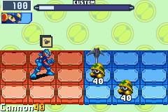
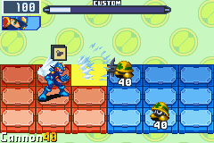

# バトルオブジェクト

バトルオブジェクトは、ウイルスやナビ、チップが出すオブジェクトなど様々なバトル中のオブジェクトの便宜的な呼称です。

ここではバトルオブジェクトの構造と、それ以外の衝突データやAIデータなどのデータについて説明します。

これで大体の主要な機能は揃っていますが、まだまだ不明な点もあります。 いずれにしても、この情報を使ってかなり自由にバトルオブジェクトが書けるようになるはずです。

## 💥 バトルオブジェクト

まず、バトルオブジェクトそのものです。 これにはタイプ1,3,4があります。 タイプ0と2は無効なタイプで、エグゼ6にはこれらのためのメモリ領域がそもそもありません。

タイプ1と4は、デフォルトでタイムストップビットがチェックされているオブジェクトです。つまり暗転系のオブジェクトです。

ウイルスとナビはタイプ1のオブジェクトです。 タイプ4のオブジェクトは一般的に暗転チップに使用されます。タイプ3のオブジェクトは、ウイルス・ナビ・チップなど全てのものが攻撃に使用する汎用的なオブジェクトです。

### データ構造

```
00h Object flags
    Bit 0: active
    Bit 1: visable
    Bit 2: updates during pause
    Bit 3: Hide/Dont update sprite
    Bit 4: updates during timestop
    Bit 5:
    Bit 6:
    Bit 7:
01h Object index
02h Object type/sprite offset
    0x0F Object type
    0xF0 relative sprite data offset (from start of object)
03h Object memory index
04h Object parameters1
05h Object parameters2
06h Object parameters3
07h Object parameters4
08h Current state, usually
    0 - Initialize
    4 - Update
    8 - Destroy
09h Current "attack"/action (typically)
0Ah Current phase of "attack"/action (typically)
0Bh Indicates if current phase is initialized (typically)
0Ch 
0Dh 
0Eh Element
0Fh 
10h Current animation
11h Current animation(copy)
12h Panel X
13h Panel Y
14h Future Panel X
15h Future Panel Y
16h Alliance
    0 - friend
    1 - enemy
17h Direction Flip
18h Prevent animation
19h 
1ah Chips held
1bh 
1ch 
1dh 
1eh 
1fh 
20h Timer (typicaly)
22h Secondary Timer (typically)
24h Curren thp
26h Max hp
28h Name id
2Ah Chip
2Ch Damage
    8000 double damage
    4000 paralyze
    2000 Uninstall
    1000 KillerCross Skull hit
    0800 nothing
    07FF damage
2Eh Stamina damage/counter disabler
    7F stamina damage
    80 disable counter
34h Xposition
38h Yposition
3Ch Zposition
40h X velocity
44h Y velocity
48h Z velocity
4Ch Pointer to parent / pointer to childobject1
50h Pointer to childobject2
54h Collision data
58h AI Data
5Ch ?
60h-7Ch - free space for object specific variables (type 4)
60h-8Ch - free space for object specific variables (type 3)
60h-8Ch - free space for object specific variables (type 1)
```

オブジェクトは衝突データとAIデータを持つことができます。

オブジェクトのXYZ座標とXYZ速度は(16bit.16bit)の固定小数点整数です。 上位16ビットが整数部分で、下位16ビットが小数部分になっています。

また、X,Y,Z座標は、フィールドの中心からの相対座標です。

### 衝突データ

衝突データのサイズは 168バイト です。

```
00h Enabled/Disabled?
01h Collision Reigon
02h Primary Element
03h ?
04h Alliance
05h Flip
06h
07h stamina damage/counter disabler
08h poison panel timer
09h hit effect
0Ah PanelX
0Bh PanelY
0Ch Direction
0Dh Counter Timer
0Eh Hit Modifier base
0Fh Hit Modifier final
10h Status Effect base
11h Status Effect final
12h Bugs
14h
18h Secondary element Weakness
19h Secondary element
24h
26h
2Eh self damage
30h self collision type flags
34h target collision type flags
38h parent object
3Ch object flags
    00000001 Guard
    00000002 ?
    00000004 ?
    00000008 invulnerable
    00000010 airshoe
    00000020 floatshoe
    00000040 currently moving
    00000080 ?
    00000100 ?
    00000200 ?
    00000400 ?
    00000800 paralyzed
    00001000 ?
    00002000 ?
    00004000 immobilized
    00008000 ?
    00010000 frozen
    00020000 superarmor
    00040000 undershirt
    00080000 currently moving
    00100000 ?
    00200000 ?
    00400000 ?
    00800000 ?
    01000000 ?
    02000000 affected by ice
    04000000 ?
    08000000 unaffected by poison
    10000000 ?
    20000000 ?
    40000000 ?
    80000000 ?
40h object flags2
44h collision index bit
54h ?
70h flags from a collision(bits from Collision Type list)
74h !! indicator
75h damage multiplier
76h damage elements
7Ch
80h final damage
82h PanelDamage1
84h PanelDamage2
86h PanelDamage3
88h PanelDamage4
8Ah PanelDamage5
8Ch PanelDamage6, used for poison
A4h Inflicted Bugs
```

### AIデータ

AIデータのサイズは 256バイト です。

```
00h Virus/Navi indicator
    00h Virus
    01h Navi
    02h Player
01h AI index
02h 
03h 
0Eh FF
16h Version/Level
17h Version/Level
18h 
19h 
20h total damage received
22h keys held
24h keys down
26h keys up
28h previous keys held
34h anger bool
80h start of AI state (0x20 bytes)
A0h start of attack variable reigon (0x50 bytes)
```

### 衝突タイプ

[衝突タイプ](object_collision_type.md)参照

## 📚 Important Object Functions (same for both games)

```
.definelabel sound_play, 0x080005CC
.definelabel bgmusic_play, 0x080005D4
.definelabel sprite_load_animation_data, 0x080026A4
.definelabel sprite_update, 0x080026C4
;r0 = 0x80
;r1 = sprite category
;r2 = sprite index
.definelabel sprite_load, 0x080026E4
.definelabel sprite_initialize, 0x0800272C
.definelabel sprite_decompress,0x08002B30
.definelabel sprite_set_scale_parameters,0x08002C24
.definelabel sprite_set_mosaic_scaling_parameters, 0x08002C7E
.definelabel sprite_get_mosaic_scaling_parameters, 0x08002CE0
.definelabel sprite_make_scalable, 0x08002D14
.definelabel sprite_make_unscalable, 0x08002D52
.definelabel sprite_set_palette, 0x08002D80
.definelabel sprite_get_palette, 0x08002D8C
.definelabel sprite_set_animation_alt, 0x08002D98
.definelabel sprite_set_animation, 0x08002DA4
.definelabel sprite_force_white_palette,0x08002DB0
.definelabel sprite_set_final_palette, 0x08002DB4
.definelabel sprite_get_final_palette, 0x08002DC8
.definelabel sprite_clear_final_palette, 0x08002DD8
.definelabel sprite_get_frame_parameters, 0x08002DEA
.definelabel sprite_has_shadow, 0x08002E3C
.definelabel sprite_set_color_shader, 0x08002ED0
.definelabel sprite_get_color_shader, 0x08002EDC
.definelabel sprite_set_mosaic_size, 0x08002EF6
.definelabel sprite_set_flip, 0x08002F5C
.definelabel sprite_get_flip, 0x08002F7E
.definelabel sprite_no_shadow, 0x08002F90
.definelabel sprite_set_coordinates, 0x0800307C
.definelabel sprite_add_coordinates, 0x0800308A
.definelabel sprite_get_coordinates, 0x080030A8
;r0 = object id
;r1 = xcoordinate
;r2 = ycoordinate
;r3 = zcoordinate
;r4 = parameter word
.definelabel object_spawn_type1, 0x08003320
;r0 = object id
;r1 = xcoordinate
;r2 = ycoordinate
;r3 = zcoordinate
;r4 = parameter word
.definelabel object_spawn_type3, 0x08003358
;r0 = object id
;r1 = xcoordinate
;r2 = ycoordinate
;r3 = zcoordinate
;r4 = parameter word
.definelabel object_spawn_type4, 0x080033AC
.definelabel object_free_memory, 0x08003458
.definelabel engine_set_screeneffect, 0x08006270
.definelabel engine_is_screeneffect_animating, 0x080062F8
.definelabel math_sin_table, 0x080065E0
.definelabel math_cos_table, 0x08006660
.definelabel battle_is_paused, 0x0800A03C
.definelabel battle_is_timestop, 0x0800A098
.definelabel battle_is_battle_over, 0x0800A18E
.definelabel battle_set_flags, 0x0800A2D8
.definelabel battle_clear_flags, 0x0800A2E4
.definelabel battle_get_flags, 0x0800A2F0
.definelabel battle_network_invert, 0x0800A9EC
.definelabel battle_clear_enemy_fadein_list, 0x0800A9F6
.definelabel object_timefreeze_begin, 0x0800B916
.definelabel object_dim_screen, 0x0800B94C
.definelabel object_draw_chipname, 0x0800B9B0
.definelabel object_undim_screen, 0x0800BC88
.definelabel object_timefreeze_end, 0x0800BD34
.definelabel object_get_panel_parameters, 0x0800C8F8
.definelabel object_get_panel_data_offset, 0x0800C90A
.definelabel object_update_panel_parameters, 0x0800C928
.definelabel object_crack_panel, 0x0800C938
.definelabel object_crack_panel_dup1, 0x0800C998
.definelabel object_break_panel, 0x0800C9F8
.definelabel object_break_panel_dup1, 0x0800CA34
.definelabel object_break_panel_dup2, 0x0800CA8C
.definelabel object_break_panel_dup3, 0x0800CAE8
.definelabel object_break_panel_loud, 0x0800CB44
.definelabel object_panel_set_poison, 0x0800CBA0
.definelabel object_highlight_panel, 0x0800CBD8
.definelabel object_highlight_panel_blue, 0x0800CBEE
.definelabel object_set_panel_type, 0x0800CC0A
.definelabel object_set_panel_alliance, 0x0800CC14
.definelabel object_set_panel_alliance_timer_long, 0x0800CC36
.definelabel object_set_panel_alliance_timer_short, 0x0800CC44
.definelabel object_set_panel_type_blink, 0x0800CC52
.definelabel object_is_current_panel_solid,0x0800CCA6
.definelabel object_is_panel_solid, 0x0800CCB2
.definelabel object_is_current_panel_valid, 0x0800CC66
.definelabel object_is_valid_panel, 0x0800CC72
.definelabel object_check_panel_parameters, 0x0800CC86
.definelabel object_highlight_current_collision_panels, 0x0800CCBE
.definelabel object_highlight_panel_region, 0x0800CCD4
.definelabel object_highlight_panel_region_blue, 0x0800CD20
.definelabel object_get_panels_type_alliance_count, 0x0800CDB4
.definelabel object_get_panels_type_count, 0x0800CE04
.definelabel object_hide_panel, 0x0800CE32
.definelabel object_show_panel, 0x0800CE42
.definelabel object_get_panels_except_current_filtered, 0x0800CE64
.definelabel object_get_panels_filtered, 0x0800CEA0
.definelabel object_get_random_panel_from_current_column, 0x0800CED0
.definelabel object_get_panels_in_column_ignore_row_filtered, 0x0800CF14
.definelabel object_get_panels_in_row_ignore_column_filtered, 0x0800CF42
.definelabel object_get_panels_ignore_row_filtered, 0x0800CF70
.definelabel object_get_panels_ignore_column_filtered, 0x0800CFA6
.definelabel object_get_panels_in_column_filtered, 0x0800CFDC
.definelabel object_get_panels_in_row_filtered, 0x0800D012
.definelabel object_get_enemy_player_panel_y, 0x0800D048
.definelabel object_get_enemy_player_panels, 0x0800D06A
.definelabel object_get_closest_panel_matching_row_filtered, 0x0800D086
.definelabel object_get_first_panel_in_direction_filtered, 0x0800D0BC
.definelabel object_get_first_panel_in_direction_within_distance_filtered, 0x0800D0DC
.definelabel object_get_first_panel_in_direction_filtered_dup1, 0x0800D100
.definelabel object_get_panel_reigon, 0x0800D3FE
.definelabel object_get_edge_panel_matching_row, 0x0800D4C2
.definelabel object_get_coordinates_for_panels, 0x0800E276
.definelabel object_set_coordinates_from_panels, 0x0800E29C
.definelabel object_set_panels_from_coordinates, 0x0800E2AC
.definelabel object_get_enemy_direction, 0x0800E2C0
.definelabel object_get_alliance_direction, 0x0800E2C2
.definelabel object_get_front_direction, 0x0800E2CA
.definelabel object_get_flip_direction, 0x0800E2CE
.definelabel object_subtract_hp, 0x0800E2D8
.definelabel object_add_hp, 0x0800E2EC
.definelabel object_calculate_final_damage1, 0x0800E3DE
.definelabel object_calculate_final_damage2, 0x0800E420
.definelabel object_get_flip, 0x0800E456
.definelabel object_can_move, 0x0800E5E2
.definelabel object_set_counter_time, 0x0800E9DC
.definelabel object_set_invulnerable_time, 0x0800EAFA
.definelabel object_get_enemy_by_name_range, 0x0800EBD4
.definelabel object_spawn_hiteffect, 0x0800EB9E
.definelabel object_create_ai_data, 0x0800ED2C
.definelabel enemy_get_struct1, 0x0800F214
.definelabel enemy_get_struct2, 0x0800F23C
.definelabel object_set_default_counter_time, 0x0800FDB6
.definelabel object_set_animation, 0x0800F2B6
.definelabel object_apply_damage, 0x0801162A
.definelabel object_setattack0,0x08011680
.definelabel object_setattack1,0x08011684
.definelabel object_setattack2,0x08011688
.definelabel object_setattack3,0x0801168C
.definelabel object_setattack4,0x08011690
.definelabel object_setattack5,0x08011694
.definelabel object_exit_attack_state, 0x08011714
.definelabel object_generic_destroy, 0x08016C8A
.definelabel object_create_collision_data, 0x08019892
;r0 = collision data offset
;r1 = self collision type
;r2 = target collision type
;r3 = collision modifier
.definelabel object_setup_collision_data, 0x08019FB4
.definelabel object_remove_collision_data, 0x0801A00E
.definelabel object_present_collision_data, 0x0801A018
.definelabel object_update_collision_panels, 0x0801A04C
.definelabel object_set_collision_panels_to_current, 0x0801A066
.definelabel object_clear_collision_reigon, 0x0801A074
.definelabel object_set_collision_reigon, 0x0801A07C
.definelabel object_spawn_collision_effect, 0x0801A0D4
.definelabel object_set_collision_hit_effect, 0x0801A140
.definelabel object_set_flag, 0x0801A152
.definelabel object_clear_flag, 0x0801A15C
.definelabel object_get_flag, 0x0801A166
.definelabel object_set_flag2, 0x0801A16C
.definelabel object_clear_flag2, 0x0801A176
.definelabel object_get_flag2, 0x0801A180
.definelabel object_set_collision_status_effect1, 0x0801A258
.definelabel object_set_collision_status_effect2, 0x0801A25E
.definelabel object_reserve_panel, 0x0801BB1C
.definelabel object_remove_panel_reserve, 0x0801BB46
.definelabel object_update_sprite, 0x0801BBAC
.definelabel object_update_sprite_timestop, 0x0801BBF4
.definelabel object_update_sprite_paused, 0x0801BCA6
.definelabel sprite_getflip_from_r0, 0x08022F7E
;Game Dependent Labels
;r0 =panelx
;r1 =panely
;r2 =element
;r3 =zcoordinate
;r4 =parameter word (SelfType | TargetType | hit effect| shape)
;r5 =parent object
;r6 =damage
;r7 =(????|Status effect|hit modifiers)
.definelabel spawn_collision_region, 0x080C536A
```

## ⚙️ 解析の例1 メタルブレード



上の例はGreiga Master氏のパッチ中のメタルブレードのチップのコードを修正したものです。

この例では、グレイガUS、ファルザーUSで`0x081CA740`から始まる未使用のBN5スプライトにアタックルーチンとオブジェクトルーチンを書き込むコードを書いています。

これにより、関連する全てのルーチンへのジャンプがより簡単になります。

この例では、衝突データを作成して移動できるシンプルなオブジェクトを扱います。

### アタックルーチン

まず、新しいオブジェクトを生成するためにアタックルーチンを作成する必要があります。 攻撃中、r7は常に現在の`AttackVars`であり、r6 は常に`AIState`です。

```asm
metalblade_attack_mainloop:
    push {r14}
    ldr r1, [metalblade_attack_mainloop_pool]
    ldrb r0,[r7]    ; get which phase we left off on
    ldr r1,[r1,r0]
    mov r14,r15
    bx r1
    pop {r15}
    .balign 4, 0
metalblade_attack_mainloop_pool:
    .word metalblade_attack_init | 1
    .word metalblade_attack_update | 1

; initルーチン
metalblade_attack_init:
    push {r14}
    ldrb r0, [r7,0x01]  ; BattleObject.CurAnim or BattleObject.CurAnimCopy
    cmp r0, 0x00
    bne .initialized
.init
    mov r0,0x04
    strb r0, [r7,0x01]
    ; initフェイズのタイマーを設定
    mov r0,0x08
    strh r0, [r7,0x10]  ; BattleObject.Timer or BattleObject.Timer2
    ; アニメーションの設定+カウンター時間の設定
    mov r0,0x0c
    bl object_set_animation
    bl object_set_default_counter_time
    b .endroutine
.initialized:
    ; タイマーのカウントが0になるのを待つ(ブレードを投げるのを少し待っている)
    ldrh r0, [r7,0x10]
    sub r0,0x01
    strh r0, [r7,0x10]
    bgt .endroutine
    mov r0,4
    strh r0,[r7]
.endroutine:
    pop {r15}

; updateルーチン
metalblade_attack_update:
    push {r4,r5,r6,r7,r14}
    ldrb r0, [r7,0x01]
    cmp r0, 0x00
    bne .initialized
.init
    ; updateフェイズのタイマーを設定
    mov r0, 0x18
    strh r0, [r7,0x10]
    ; ???
    mov r0, 0x04
    strb r0, [r7,0x01]
    ; メタルブレードを生成
    bl object_get_front_direction
    ldrb r1,[r5,0x12]           ; プレイヤーの目の前のパネル
    add r0,r1,r0                ; メタブレのパネルX(r0)
    ldrb r1,[r5,0x13]           ; メタブレのパネルY(r1)
    mov r2,AttackElement_Break  ; メタブレの属性(r2)
    mov r3,0x16
    lsl r3,0x10                 ; メタブレのZ座標(r3)
    ldr r4, [r7,0x0C]           ; metal blade parameters(r4)
    ldr r6, [r7,0x08]           ; metal blade damage(r6)
    bl spawn_metalblade
    b .endroutine
.initialized:
    ; タイマーのカウントが0になるのを待つ(この間が攻撃時間？)
    ldrh r0, [r7,0x10]
    sub r0,r0,1
    strh r0, [r7,0x10]
    bgt .endroutine
    bl object_exit_attack_state ; 攻撃を終了する
.endroutine:
    pop {r4,r5,r6,r7,r15}
```

mainloopルーチンは、アタックルーチンの現在のフェイズを取得し、initフェイズならinitルーチン、updateフェイズならupdateルーチンにジャンプします。

initルーチンはアニメーションを設定し、カウンター時間を設定し、ブレードを投げるのを少し待ちます。

updateルーチンは、メタルブレードを生成し、攻撃を終了する前で少しの間待ちます。この待ち時間が攻撃時間になっているようです？

メタルブレードを生成するルーチンは以下のようになります。

```asm
; メタルブレードオブジェクトを作成
spawn_metalblade:
    push {r14}
    push {r0,r1,r2,r5}  ; save panelx, panely, element, and parent
    mov r0, demo_object_id
    bl object_spawn_type3
    mov r0,r5
    pop {r1,r2,r3,r5}   ; restore panelx, panely, element, and parent
    beq .endroutine
    strb r1, [r0,0x12]  ; set panelx
    strb r2, [r0,0x13]  ; set panely
    strb r3, [r0,0x0E]  ; set element
    str r5, [r0,0x4C]   ; set parent object
    str r6, [r0,0x2C]   ; set damage
    ldrh r3, [r5,0x16]
    strh r3, [r0,0x16]  ; make child object same alliance as parent
.endroutine:
    pop r15
```

この生成ルーチンは、引数として `panelX`, `panelY`, `element`, `zCoordinate`, `parameter`(4byte), `parent`(親オブジェクト), `damage` を取ります。

ただし内部で呼び出している、`object_spawn_type3` は引数として `objectid`, `xoordinate`, `ycoordinate`, `zcoordinate`, `parameter(4byte)` を取ることに注意してください。

このため、オブジェクトを初期化しながらパネルから座標を設定することが重要です。

### オブジェクトルーチン

アタックルーチンと同様に、メタルブレードオブジェクトにも、攻撃が現在どのフェーズにあるかをジャンプするためのメインループが必要です。

```asm
metalblade_object_mainloop:
    push r14
    ldr r1,[metalblade_object_mainloop_pool]
    ldrb r0, [r5,0x08]
    ldr r1, [r1,r0]
    mov r14,r15
    bx r1
    pop r15
    .balign 4, 0
metalblade_object_mainloop_pool:
    .word metalblade_object_init | 1
    .word metalblade_object_update | 1
    .word object_generic_destroy | 1  ; generic destructor works for most objects
```

処理の流れはアタックルーチンの場合と全く同じで、mainloopルーチンは、オブジェクトルーチンの現在のフェイズを取得し、initフェイズならinitルーチン、updateフェイズならupdateルーチンにジャンプします。今回はさらにdestroyルーチンも追加されています。

initルーチンでは、オブジェクトをvisibleにし、スプライトをロードし、衝突データを作成し、オブジェクト固有の変数を設定する必要があります。

```asm
metalblade_object_init:
    push {r4,r5,r6,r7,r14}

    ; BattleObject.FlagsのBit1(visibleフラグ)を立てる
    ldrb r0, [r5]
    mov r1, 0x02
    orr r0,r1
    strb r0, [r5]

    ; set proper coordinates for panel
    bl object_set_coordinates_from_panels

    ; メタブレのスプライトをロード
    mov r0, 0x80
    mov r1, 0x00
    mov r2, 0x0D
    bl sprite_load

    ; initialize to animation 0
    mov r0,0x00
    strh r0, [r5,0x10]

    ; initialize essential sprite stuff
    bl sprite_set_animation
    bl sprite_load_animation_data
    bl sprite_update        ; updates sprite data
    bl sprite_has_shadow    ; First oam is considered shadow, wont move with z
    bl object_get_flip
    bl sprite_set_flip      ; make sure the object is facing the right direction based on alliance

    ; setup movement velocities
    bl object_get_front_direction
    mov r1,0x08         ; x velocity is 8 pixels
    mul r0,r1           ; set direction
    lsl r0,r0,0x10      ; coordinates are shift left 16
    str r0, [r5,0x40]   ; set velocity
    mov r1,0x06         ; x velocity is 6 pixels
    lsl r1,r1,0x10
    str r1, [r5,0x44]   ; set velocity

    ; setup number of times to loop
    mov r0,0x3
    str r0, [r5,0x60]

    ; 衝突オブジェクトを作成
    bl object_create_collision_data
    ; object_create_collision_dataによって衝突オブジェクトが作成された -> .collisioninit
    tst r0,r0
    bne .collisioninit
    ; 作成されなかった
    bl object_free_memory   ; if it wasnt destroy the object
    pop {r4,r5,r6,r7,r15}
.collisioninit:
    ; 衝突オブジェクトのプロパティを設定
    mov r1,0x04     ; 自身の衝突タイプ
    mov r2,0x05     ; ターゲットの衝突タイプ
    mov r3,0x01     ; ヒットした時の挙動(ひるみ、インビジなど)
    bl object_setup_collision_data
    mov r0,0x0A     ; Break hit effect
    bl object_set_collision_hit_effect
    bl object_present_collision_data
    mov r0,0x8F
    bl sound_play   ; play whir sound

    ; 次にmainloopが実行された時はupdateルーチンに
    mov r0,4
    strh r0, [r5,0x08]
    pop {r4,r5,r6,r7,r15}
```

`sprite_load`は0x80を引数として受け取り，対象のスプライトのカテゴリIDとインデックスを取得します。

スプライトのカテゴリIDとインデックスは、ミステリーデータのスプライトハッキングで取得できます。

この例では、獣化(ファルザー)のスプライトの直後の`WhiteDot`スプライトを使っています。

衝突オブジェクトが作成された場合は、`object_setup_collision_data`で各プロパティを設定します。衝突タイプとヒット時の挙動を設定しています。上記の衝突タイプのリストから、このオブジェクトの衝突タイプは味方による攻撃扱いになります。つまりこの攻撃のターゲットは`Neutral Support Objects`, `Enemy Support Objects`, `Enemy`, `Enemies`, `Attack Objects` を対象としています。またヒット時の挙動は、インビジ状態にならず怯むように今回は設定します。

次にupdateルーチンです。 このルーチンでは衝突を処理する必要があります。

```asm
metalblade_object_update:
    push {r14}
    bl object_remove_collision_data
    bl object_spawn_collision_effect
    ldr r0, [r5,0x54]
    ldr r1, [r0,0x70]
    tst r1,r1
    beq .nocollision
    bl clearCollisionRegion    ; オブジェクトが無限にヒットしないように衝突した領域をクリア
.nocollision:
    ldrh r4, [r5,0x12]
    ldrb r0, [r5,0x09]
    ldr r1, [metalblade_object_update_pool]
    ldr r0, [r1,r0]
    mov r14,r15
    bx r0
    bl object_set_panels_from_coordinates
    bl object_update_collision_panels
    bl object_present_collision_data
    ldrh r0, [r5,0x12]
    cmp r0,r4
    beq .dontupdate
    mov r0,0x01
    bl object_set_collision_reigon
.dontupdate:
    bl object_update_sprite
    pop {r15}

metalblade_object_update_pool:
    .word metalblade_object_update_initialmove | 1  ; move foward looking for targets
    .word metalblade_object_update_downmove | 1     ; move down 1 panel
    .word metalblade_object_update_leftmove | 1     ; move left 1 panel
    .word metalblade_object_update_upmove | 1       ; move up 1 panel
    .word metalblade_object_update_rightmove | 1    ; move right 1 panel
```

updateルーチンの間、オブジェクトは衝突が起きたかどうかをチェックし、衝突した場合は`object_remove_collision_data`を使用してパネルから衝突が発生したという判定を消す必要があります。これを忘れてしまうと、オブジェクトによるパネルにダメージを与える判定が残り続けてしまいます。

次に、衝突データの`FlagsFromCollision`をチェックすることで、オブジェクトが何かにぶつかったかどうかをチェックする必要があります。

オブジェクトが何かに衝突した場合は、`clearCollisionRegion`を呼び出して衝突した領域をクリアして、オブジェクトが無限にヒットしないようにすることが重要です。

衝突した領域が再び設定されると、オブジェクトのパネルは衝突してから変更されていますが、オブジェクトのパネルは一緒に更新されません。

座標を変更した後は、`object_set_panels_from_coordinates`でパネルを更新し、衝突パネルも一致するように更新しなければなりません。

最後に `object_present_collision_data` を呼び出して、そのデータをパネルに配置しなければなりません。

movementルーチンのコードは、添付のフルコードにあります。

## 🧲 解析の例2 Magtect



この例では、プレイヤーの入力を受けて外部衝突領域を使用するサポートオブジェクトを使用した攻撃について説明します。

### アタックルーチン

この攻撃のアタックルーチンのmainloopルーチンはメタルブレードに比べてシンプルです。

```asm
magtect_attack_mainloop:
    push {r4,r5,r6,r7,r14}
    ldrb r0, [r7,0x01]
    cmp r0, 0x00
    bne .initialized
    mov r0,0x04
    strb r0, [r7,0x01]

    ; set timer for phase
    mov r0,0x08
    strh r0, [r7,0x10]
    mov r0,0x0c
    bl object_set_animation
    bl object_set_default_counter_time
    bl object_get_front_direction
    ldrb r1,[r5,0x12]           ; panel in front of you
    add r0,r1,r0                ; magtect panelx
    ldrb r1,[r5,0x13]           ; magtect panely
    mov r2,AttackElement_Elec   ; magtect element
    mov r3,0x00                 ; magtect z coordinate
    ldr r4, [r7,0x0C]           ; magtect parameters
    ldr r6, [r7,0x08]           ; magtect blade damage
    mov r7,0x4C
    add r7,r5,r7
    bl spawn_magtect
    str r0, [r5,0x4C]           ; store child object
    b .endroutine
.initialized:
    ; as long as megtect still exists attack continues
    ldr r0, [r5,0x4C]
    tst r0,r0
    bne .endroutine
    bl object_exit_attack_state
.endroutine:
    pop {r4,r5,r6,r7,r15}
```

子オブジェクトのポインタを 0x4C に格納することが重要です。 例えばダメージを受けた後などで攻撃が終了した時に、このポインタはクリアされるので、オブジェクトが攻撃が終了していないかどうかをトレースするために必要です。

また、オブジェクトが破壊された場合も攻撃を終了させるために一度だけこのポインタをクリアすることができます。

```asm
; creates magtect object
spawn_magtect:
    push {r14}
    push {r0,r1,r2,r5}
    mov r0, demo_object_id
    bl object_spawn_type3
    mov r0,r5
    pop {r1,r2,r3,r5}
    beq .endroutine
    strb r1, [r0,0x12]
    strb r2, [r0,0x13]
    strb r3, [r0,0x0E]
    str r5, [r0,0x4C]
    str r6, [r0,0x2C]
    ldrh r3, [r5,0x16]
    strh r3, [r0,0x16]
    str r7, [r0,0x60]
.endroutine:
    pop {r15}
```

これはメタルブレードのスポーンルーチンに似ていますが、今回は親が子オブジェクトを格納する場所が r7 になっています。

### オブジェクトルーチン

```asm
magtect_object_mainloop:
    push {r14}
    ldr r1, [magtect_object_mainloop_pool]
    ldrb r0, [r5,0x08]
    ldr r1, [r1,r0]
    mov r14,r15
    bx r1
    pop {r15}
    .balign 4, 0
magtect_object_mainloop_pool:
    .word magtect_object_init | 1
    .word magtect_object_update | 1
    .word object_generic_destroy | 1    ; boilerplate destructor

magtect_object_init:
    push {r4,r5,r6,r7,r14}

    ; set visable bit (2)
    ldrb r0, [r5]
    mov r1, 0x02
    orr r0,r1
    strb r0, [r5]

    ; set proper coordinates for panel
    bl object_set_coordinates_from_panels

    ; load magtect sprite
    mov r0, 0x80
    mov r1, 0x00
    mov r2, 0x0D
    bl sprite_load

    ; initialize to animation 0
    mov r0,0x00
    strh r0, [r5,0x10]

    ; initialize essential sprite stuff
    bl sprite_set_animation
    bl sprite_load_animation_data
    bl sprite_update        ; updates sprite data
    bl sprite_has_shadow    ; Shadow should not follow main sprite accross Z
    bl object_get_flip
    bl sprite_set_flip
    bl object_create_collision_data
    tst r0,r0
    bne .collisioninit
    bl magtect_destroy
    pop {r4,r5,r6,r7,r15}
.collisioninit:
    mov r1,0x29
    mov r2,0x0D
    mov r3,0x03
    bl object_setup_collision_data
    mov r0,0x03
    bl object_set_collision_hit_effect

    ; give 40 HP
    mov r0,40
    strh r0, [r5,0x24]
    strh r0, [r5,0x26]

    ; set to update routine
    mov r0,4
    strh r0, [r5,0x08]
    pop {r4,r5,r6,r7,r15}
```

オブジェクトルーチンのmainloopはメタルブレードのものと同じです。メタルブレード同様に初期化処理を行っていますが、メタルブレードと違うのは、今回はオブジェクトのHPが新たに設定されている点です。

コリジョンは、衝突タイプを0x29、ターゲットを0x0dに設定しています。これはオブジェクトが`Movement Blocking(?)`で、味方のサポートオブジェクトであり、ターゲットが敵全般(`Neutral Support Objects`, `Enemy Support Objects`)であることを意味しています。

また、敵の出したアタックオブジェクトや敵の攻撃によるコリジョンを受け付けるので、このマグテクトにはダメージを与えることができます。 

衝突データを作成できない場合は、`object_free_memory`の代わりに`magtect_destroy`を使用してオブジェクトを破壊します。

```asm
magtect_destroy:
    push {r14}
    bl object_clear_collision_region
    mov r0,0x08
    str r0, [r5,0x08]   ; set to destroy routine
    mov r0,0x00
    ldr r1, [r5,0x60]   ; get parents pointer to this object
    str r0, [r1]        ; clear object
    pop {r15}
```

このオブジェクトが破壊されると、衝突データをクリアしなければいけません。そうしないとメタルブレード同様にフィールドにダメージ判定のあるパネルを残すことになります。

また、このオブジェクトは、攻撃状態から抜けることを知るために、このオブジェクトへの親参照をクリアする必要があります。

```asm
magtect_object_update:
    push {r14}
    bl object_remove_collision_data
    bl object_spawn_collision_effect
    mov r0,0x00
    bl object_apply_damage
    tst r0,r0           ; check if dead
    bne .dead
    ldr r0, [r5,0x60]   ; get parents refence to this object
    ldr r0, [r0]        ; check if its still there
    tst r0,r0
    beq .dead           ; if its cleared parent is not in attack state
    ldrb r0, [r5,0x09]
    ldr r1, [magtect_object_update_pool]
    ldr r0, [r1,r0]
    mov r14,r15
    bx r0
    bl object_update_sprite
    b .endroutine
.dead:
    bl magtect_destroy
.endroutine:
    bl object_present_collision_data
    pop {r15}
    .balign 4, 0
magtect_object_update_pool:
    .word magtect_object_update_idle | 1    ; wait for button presses
    .word magtect_object_update_pull | 1    ; pull enemy towards magtect while B pressed
    .word magtect_object_update_attack | 1  ; magnet attack
```

ダメージのチェックは`object_apply_damage`で行われます。この関数はオブジェクトのHPが0なら`1`を、そうでない場合は`0`を返します。この関数はHPが0になったオブジェクトの爆発処理も行います。

次にオブジェクトは、このオブジェクトに対して親からの参照が残っているかどうかをチェックしなければなりません。もし残っていなければ、親は攻撃状態を終了したことになり、このオブジェクトは必要なくなります。

この場合、updateルーチンは、オブジェクトの現在の状態に応じた関数、idle(`magtect_object_update_idle`), pull(`magtect_object_update_pull`), attack(`magtect_object_update_attack`)にジャンプします。


```asm
magtect_object_update_idle:
    push {r4,r5,r6,r7,r14}
    ldrb r0, [r5,0x0A]
    tst r0,r0
    bne .initialized
    mov r0,0x00
    strb r0, [r5,0x10]          ; idle animation
    mov r0,0x04
    strb r0, [r5,0x0A]
.initialized:
    ldr r0, [r5,0x4C]           ; get parent
    ldr r0, [r0,0x58]           ; get parent AI data
    ldrh r1, [r0,0x22]          ; get keys held
    mov r2,GBAKEY_A
    tst r1,r2
    beq .dead
    mov r2, GBAKey_B
    tst r1,r2
    beq .endroutine
    ; B pressed goto pull
    mov r0,0x04
    strb r0, [r5,0x09]
    mov r0,0x00
    strb r0, [r5,0x0A]
    b .endroutine
.dead:
    bl magtect_destroy
.endroutine:
    pop {r4,r5,r6,r7,r15}
```

```asm
magtect_object_update_pull:
    push r4-r7,r14
    ldrb r0, [r5,0x0A]
    tst r0,r0
    bne .initialized
    mov r0,0x01
    strb r0, [r5,0x10]          ; pull animation
    mov r0,0x04
    strb r0, [r5,0x0A]
    mov r0,0xF3
    bl sound_play               ; play wavey sound

.initialized:
    ; create collision object to pull enemies
    bl object_get_front_direction
    ldrb r1, [r5,0x12]
    add r0,r1,r0                ; get panelx in front of magtect
    ldrb r1, [r5,0x13]          ; get panel y
    mov r2, AttackElement_NULL  ; no element
    mov r3,0x00                 ; z = 0

    ; from left to right, collision setup r1, r2, hiteffect, shape
    ldr r4, =0x0405FF08
    mov r6,0x00                 ; no damage
    mov r7,0x04                 ; pull enemy towards magtect
    bl spawn_collision_region

    ldr r0, [r5,0x4C]           ; get parent
    ldr r0, [r0,0x58]           ; get parent AI data
    ldrh r1, [r0,0x22]          ; get keys held
    mov r2, GBAKey_B
    tst r1,r2
    bne .endroutine

    ; B released go to attack phase
    mov r0,0x08
    strb r0, [r5,0x09]
    mov r0,0x00
    strb r0, [r5,0x0A]
.endroutine:
    pop r4-r7,r15
```

```asm
magtect_object_update_attack:
    push r4-r7,r14
    ldrb r0, [r5,0x0A]
    tst r0,r0
    bne .initialized
    mov r0,0x02
    strb r0, [r5,0x10]          ; pull animation
    mov r0,0x04
    strb r0, [r5,0x0A]
    mov r0,0xF
    strh r0, [r5,0x20]          ; timer for this phase

    ; create collision object to pull enemies
    bl object_get_front_direction
    ldrb r1, [r5,0x12]
    add r0,r1,r0                ; get panelx in front of magtect
    ldrb r1, [r5,0x13]          ; get panel y
    mov r2, AttackElement_Elec  ; no element
    mov r3,0x00                 ; z = 0

    ; from left to right, collision setup r1, r2, hiteffect, shape
    ldr r4, =0x04050301         ;
    ldr r6, [r5,0x2C]           ; attack damage
    mov r7,0x03                 ; Flinches and causes invis
    bl spawn_collision_region
    mov r0,0xBA
    bl sound_play               ; play spark sound
.initialized:
    ldrh r0, [r5,0x20]
    sub r0,0x01
    strh r0, [r5,0x20]
    bgt .endroutine

    ; go back to idle phase after time expires
    mov r0,0x00
    strb r0, [r5,0x09]
    strb r0, [r5,0x0A]
.endroutine:
    pop r4-r7,r15
```

すべてのルーチンは、親オブジェクト構造体を取得し、次にそのAI構造体を取得します。そして、この構造体を使ってプレイヤーの入力を取得します。

The Pull and Attack states rely on collision regions. This is a separate object the game commonly uses to create collisions in a timing sensitive manner.

Pull uses a collision region that's in the shape of a 6x1 line that has the pull property is non-flinching to create the magnet pull effect.

Attack then uses another collision region to attack the panel in front of the magtect without having to modify the object's collision region.

You can look at the attached full code to see how the objects/attacks were added to the game.

## 参考記事

- [BN6 Battle Objects Data](https://forums.therockmanexezone.com/bn6-battle-objects-data-t5346.html)
- [BN5/BN6 Battle Objects](https://forums.therockmanexezone.com/viewtopic.php?p=344491#p344491)
