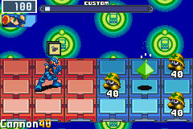

# バトルミステリーデータ



後半のゲームでは、ミステリーデータが戦闘時にフィールドに出現することがあります。壊さずに戦闘に勝利すると、そのデータを手に入れることができます。

ここではそのミステリーデータのことをバトルミステリーデータと呼びます。

以下の情報はFalzarUSに関するものです。

## Object settings

```go
// バトルミステリーデータ(4byte)
type MysteryData struct {
    Type byte   // 0x20で固定
    YX byte     // Y = Yパネル (8bit, 1-3), X = Xパネル (8bit, 1-6)
    GC byte     // G = 報酬グループ (8bit, 0-7), C = 出現確率 (8bit, 0-15)
    Pad byte   // 0x00で固定
}
```

バトルミステリーデータを出現させるには、バトルにミステリーデータのオブジェクトを追加する必要があります。バトルに追加できるオブジェクトはさまざまですが、全て4バイトで、ミステリーデータも同様です。ミステリーデータの場合は最初のオブジェクトタイプを0x20に設定する必要があります。

2バイト目の座標は説明不要でしょう。xyともにパネル単位での座標です。

3バイト目の下位8bit(`C`)はそのバトルでミステリーデータが出現する確率を表しています。これは15分の1で表されるので、0x00の値が0%の確率を意味し、0x0Fの値が100%の確率を意味します。

3バイト目の上位8bit(`G`)は、バトルミステリーデータがどの報酬グループに属しているかを示しています。エグゼ6には8種類の報酬グループがあり、それぞれ8つの報酬があります（1つはランダムに選択されます）。FalzarUSの場合、報酬グループのデータは`0x080211A0`にあります。

このシステムは昔からバグっています。出現するかどうかを確認する際に、上位ビットも確率計算に含めてしまうので、2つ目の報酬グループ以上を選択すると上位ビットに1があるため、ミステリーデータが常に出現してしまいます。

**報酬グループ**

```
Group 0:
43E8 1000z
43E8 1000z
C001 BugFrags 1
C001 BugFrags 1
1274 Boomer J
1274 Boomer J
2634 Tornado T
2634 Tornado T

Group 1:
45DC 1500z
45DC 1500z
C002 BugFrags 2
C002 BugFrags 2
227E AirSpin1 R
227E AirSpin1 R
1838 MegEnBom M
1838 MegEnBom M

Group 2:
47D0 2000z
47D0 2000z
C003 BugFrags 3
C003 BugFrags 3
00BC AntiSwrd A
00BC AntiSwrd A
224A WideBlde R
224A WideBlde R

Group 3:
47D0 2000z
47D0 2000z
C003 BugFrags 3
C003 BugFrags 3
08C8 TimeBom2 E
08C8 TimeBom2 E
1686 Snake L
1686 Snake L

Group 4:
47D0 2000z
47D0 2000z
C003 BugFrags 3
C003 BugFrags 3
2496 VDoll S
2496 VDoll S
34BB AntiDmg *
34BB AntiDmg *

Group 5:
49C4 2500z
49C4 2500z
C004 BugFrags 4
C004 BugFrags 4
34C1 Navi+20 *
34C1 Navi+20 *
1854 MoonBld M
1854 MoonBld M

Group 6:
4BB8 3000z
4BB8 3000z
C005 BugFrags 5
C005 BugFrags 5
1A11 GunDelS3 N
1A11 GunDelS3 N
34C4 DblPoint *
34C4 DblPoint *

Group 7:
4BB8 3000z
4BB8 3000z
C005 BugFrags 5
C005 BugFrags 5
12A1 Recov300 J
12A1 Recov300 J
228B Meteors R
228B Meteors R
```

## 参考記事

- [BN4/BN5/BN6 Battle Mystery Data](https://forums.therockmanexezone.com/bn4-bn5-bn6-battle-mystery-data-t5339.html)
