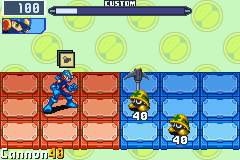
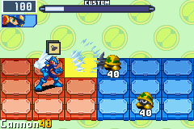

# バトルオブジェクト

ここではバトルオブジェクトの構造と、それ以外の衝突データやAIデータなどのデータについて説明します。

これで大体の主要な機能は揃っていますが、まだまだ不明な点もあります。 いずれにしても、この情報を使ってかなり自由にバトルオブジェクトが書けるようになるはずです。

## バトルオブジェクト

まず、バトルオブジェクトそのものです。 これにはタイプ1,3,4があります。 タイプ0と2は無効なタイプで、エグゼ6にはこれらのためのメモリ領域がそもそもありません。

タイプ1と4は、デフォルトでタイムストップビットがチェックされているオブジェクトです。つまり暗転系のオブジェクトです。

ウイルスとナビはタイプ1のオブジェクトです。 タイプ4のオブジェクトは一般的に暗転チップに使用されます。タイプ3のオブジェクトは、ウイルス・ナビ・チップなど全てのものが攻撃に使用する汎用的なオブジェクトです。

### データ構造

```go
type pointer = uint32
type BattleObject struct {
    Flags byte          // 01:active, 02:visible, ...
    Index byte
    TypeAndSpriteOffset byte
    ListIndex byte
    Params uint32
    CurState byte       // 08h: 0=initialize, 4=update, 8=destroy
    CurAction byte
    CurPhase byte
    PhaseInitialized bool // 1byte
    Unk_0c, Unk_0d byte
    Element byte
    Unk_0f byte
    CurAnim, CurAnimCopy byte // 10h, 11h
    PanelX, PanelY byte
    FuturePanelX, FuturePanelY byte
    Alliance byte // 0 = friend, 1 = enemy
    DirectionFlip byte
    PreventAnim byte
    Unk_19 byte
    ChipsHeld byte
    Unk_1b, Unk_1c, Unk_1d, Unk_1e, Unk_1f byte
    Timer, Timer2 uint16 // 20h, 21h
    HP uint16
    MaxHP uint16
    NameID uint16
    Chip uint16
    Damage uint16 // 0x8000 = double, 0x4000=paralyze, 0x2000=uninstall, 0x1000=killercross_skull_hit, 0x0800=nothing
    StaminaDamageCounterDisabler uint16
    Unk_30, Unk_32 uint16
    X, Y, Z uint32
    XVelocity, YVelocity, ZVelocity uint32
    RelatedObject1Ptr, RelatedObject2Ptr pointer
    CollisionDataPtr pointer // 54h
    AIDataPtr pointer
    Unk_5c uint32
    ExtraVars [n]byte // n:t1,t3=44 28=t4
    padding [4]byte
    ObjectSprite ObjectSprite
}
```

オブジェクトは衝突データとAIデータを持つことができます。

オブジェクトのXYZ座標とXYZ速度は(16bit.16bit)の固定小数点整数です。 上位16ビットが整数部分で、下位16ビットが小数部分になっています。

また、X,Y,Z座標は、フィールドの中心からの相対座標です。

### 衝突データ

```go
type Collision struct {
    Enabled bool
    Region byte
    PrimaryElement byte
    Unk03 byte
    Alliance byte
    Flip byte
    Barrier byte
    StaminaDamageCounterDisabler byte
    PoisonPanelTimer byte
    HitEffect byte
    PanelX, PanelY byte
    Direction byte // 0bh
    CounterTimer byte
    HitModifierBase, HitModifierFinal byte // 0e,0fh
    StatusEffectBase, StatusEffectFinal byte // 10,11h
    Bugs uint16 // 12h
    Unk14, Unk15, Unk16, Unk17 byte
    SecondaryElementWeakness, SecondaryElement byte
    Unk1a, Unk1c, Unk1e, Unk20, Unk22, Unk24, Unk26, Unk28, Unk2a, Unk2c uint16
    SelfDamage uint16 // 2eh
    SelfCollisionTypeFlags uint32 // 30h
    TargetCollisionTypeFlags uint32 // 34h
    ParentObjectPtr pointer // 38h
    ObjectFlags1, ObjectFlags2 uint32
    CollisionIndexBit uint32
    Unk48, Unk4c, Unk50, Unk54, Unk58, Unk5c, Unk60, Unk64, Unk68, Unk6c uint32
    FlagsFromCollision uint32 // 70h
    ExclamationIndicator byte
    DamageMultiplier byte
    DamageElements byte
    Unk77 byte
    Unk78, Unk7c uint32
    FinalDamage uint16
    PanelDamage1, PanelDamage2, PanelDamage3, PanelDamage4, PanelDamage5, PanelDamage6 uint16
    Unk8e, Unk90, Unk92 uint16
    NullElementDamage, HeatElementDamage, AquaElementDamage, ElecElementDamage, WoodElementDamage uint16
    Unk9e uint16
    UnkA0 uint32
    InflictedBugs uint32
}
```

**ObjectFlags1**

```
00000001 Guard
00000002 ?
00000004 ?
00000008 invulnerable
00000010 airshoe
00000020 floatshoe
00000040 currently moving
00000080 ?
00000100 ?
00000200 ?
00000400 ?
00000800 paralyzed
00001000 ?
00002000 ?
00004000 immobilized
00008000 ?
00010000 frozen
00020000 superarmor
00040000 undershirt
00080000 currently moving
00100000 ?
00200000 ?
00400000 ?
00800000 ?
01000000 ?
02000000 affected by ice
04000000 ?
08000000 unaffected by poison
10000000 ?
20000000 ?
40000000 ?
80000000 ?
```

### AIデータ

```go
type AI struct {
    ActorType byte // 0=ウイルス, 1=ネットナビ, 2=プレイヤー
    AIIndex byte
    Unk02 [13]byte
    Unk0E byte // 0xFFで固定?
    Unk0F [7]byte
    Version1, Version2 byte
    Unk24 [8]byte
    TotalDamageTaken uint16
    JoypadHeld, JoypadPressed, JoypadUp, JoypadReleased uint16
    Unk42 [5]uint16
    Anger uint16
    Unk54 [74]byte
    AIState [32]byte
    AttackVars [80]byte
}
```

### 衝突タイプ

[衝突タイプ](collision_type.md)参照

## 解析の例1 メタルブレード



上の例はGreiga Master氏のパッチ中のメタルブレードのチップのコードを修正したものです。

この例では、グレイガUS、ファルザーUSで`0x081CA740`から始まる未使用のBN5スプライトにアタックルーチンとオブジェクトルーチンを書き込むコードを書いています。

これにより、関連する全てのルーチンへのジャンプがより簡単になります。

この例では、衝突データを作成して移動できるシンプルなオブジェクトを扱います。

### アタックルーチン

まず、新しいオブジェクトを生成するためにアタックルーチンを作成する必要があります。 攻撃中、r7は常に現在の`AttackVars`であり、r6 は常に`AIState`です。

```asm
metalblade_attack_mainloop:
    push {r14}
    ldr r1, [metalblade_attack_mainloop_pool]
    ldrb r0,[r7]    ; get which phase we left off on
    ldr r1,[r1,r0]
    mov r14,r15
    bx r1
    pop {r15}
    .balign 4, 0
metalblade_attack_mainloop_pool:
    .word metalblade_attack_init | 1
    .word metalblade_attack_update | 1

; initルーチン
metalblade_attack_init:
    push {r14}
    ldrb r0, [r7,0x01]  ; BattleObject.CurAnim or BattleObject.CurAnimCopy
    cmp r0, 0x00
    bne .initialized
.init
    mov r0,0x04
    strb r0, [r7,0x01]
    ; initフェイズのタイマーを設定
    mov r0,0x08
    strh r0, [r7,0x10]  ; BattleObject.Timer or BattleObject.Timer2
    ; アニメーションの設定+カウンター時間の設定
    mov r0,0x0c
    bl object_set_animation
    bl object_set_default_counter_time
    b .endroutine
.initialized:
    ; タイマーのカウントが0になるのを待つ(ブレードを投げるのを少し待っている)
    ldrh r0, [r7,0x10]
    sub r0,0x01
    strh r0, [r7,0x10]
    bgt .endroutine
    mov r0,4
    strh r0,[r7]
.endroutine:
    pop {r15}

; updateルーチン
metalblade_attack_update:
    push {r4,r5,r6,r7,r14}
    ldrb r0, [r7,0x01]
    cmp r0, 0x00
    bne .initialized
.init
    ; updateフェイズのタイマーを設定
    mov r0, 0x18
    strh r0, [r7,0x10]
    ; ???
    mov r0, 0x04
    strb r0, [r7,0x01]
    ; メタルブレードを生成
    bl object_get_front_direction
    ldrb r1,[r5,0x12]           ; プレイヤーの目の前のパネル
    add r0,r1,r0                ; メタブレのパネルX(r0)
    ldrb r1,[r5,0x13]           ; メタブレのパネルY(r1)
    mov r2,AttackElement_Break  ; メタブレの属性(r2)
    mov r3,0x16
    lsl r3,0x10                 ; メタブレのZ座標(r3)
    ldr r4, [r7,0x0C]           ; metal blade parameters(r4)
    ldr r6, [r7,0x08]           ; metal blade damage(r6)
    bl spawn_metalblade
    b .endroutine
.initialized:
    ; タイマーのカウントが0になるのを待つ(この間が攻撃時間？)
    ldrh r0, [r7,0x10]
    sub r0,r0,1
    strh r0, [r7,0x10]
    bgt .endroutine
    bl object_exit_attack_state ; 攻撃を終了する
.endroutine:
    pop {r4,r5,r6,r7,r15}
```

mainloopルーチンは、アタックルーチンの現在のフェイズを取得し、initフェイズならinitルーチン、updateフェイズならupdateルーチンにジャンプします。

initルーチンはアニメーションを設定し、カウンター時間を設定し、ブレードを投げるのを少し待ちます。

updateルーチンは、メタルブレードを生成し、攻撃を終了する前で少しの間待ちます。この待ち時間が攻撃時間になっているようです？

メタルブレードを生成するルーチンは以下のようになります。

```asm
; メタルブレードオブジェクトを作成
spawn_metalblade:
    push {r14}
    push {r0,r1,r2,r5}  ; save panelx, panely, element, and parent
    mov r0, demo_object_id
    bl object_spawn_type3
    mov r0,r5
    pop {r1,r2,r3,r5}   ; restore panelx, panely, element, and parent
    beq .endroutine
    strb r1, [r0,0x12]  ; set panelx
    strb r2, [r0,0x13]  ; set panely
    strb r3, [r0,0x0E]  ; set element
    str r5, [r0,0x4C]   ; set parent object
    str r6, [r0,0x2C]   ; set damage
    ldrh r3, [r5,0x16]
    strh r3, [r0,0x16]  ; make child object same alliance as parent
.endroutine:
    pop r15
```

このルーチンは、引数として panelX, panelY, element, zCoordinate, parameter(4byte), 親オブジェクト, damage を取りますが、object_spawn_type3 は引数として objectid, xcoordinate, ycoordinate, zcoordinate, parameter(4byte) を取ることに注意してください。

このため、オブジェクトを初期化しながらパネルから座標を設定することが重要です。

### オブジェクトルーチン

アタックルーチンと同様に、メタルブレードオブジェクトにも、攻撃が現在どのフェーズにあるかをジャンプするためのメインループが必要です。

```asm
metalblade_object_mainloop:
    push r14
    ldr r1,[metalblade_object_mainloop_pool]
    ldrb r0, [r5,0x08]
    ldr r1, [r1,r0]
    mov r14,r15
    bx r1
    pop r15
    .balign 4, 0
metalblade_object_mainloop_pool:
    .word metalblade_object_init | 1
    .word metalblade_object_update | 1
    .word object_generic_destroy | 1  ; generic destructor works for most objects
```

処理の流れはアタックルーチンの場合と全く同じで、mainloopルーチンは、オブジェクトルーチンの現在のフェイズを取得し、initフェイズならinitルーチン、updateフェイズならupdateルーチンにジャンプします。今回はさらにdestroyルーチンも追加されています。

initルーチンでは、オブジェクトをvisibleにし、スプライトをロードし、衝突データを作成し、オブジェクト固有の変数を設定する必要があります。

```asm
metalblade_object_init:
    push {r4,r5,r6,r7,r14}

    ; BattleObject.Flagsの0x02を立てる(visibleフラグをセット)
    ldrb r0, [r5]
    mov r1, 0x02
    orr r0,r1
    strb r0, [r5]

    ; set proper coordinates for panel
    bl object_set_coordinates_from_panels

    ; メタブレのスプライトをロード
    mov r0, 0x80
    mov r1, 0x00
    mov r2, 0x0D
    bl sprite_load

    ; initialize to animation 0
    mov r0,0x00
    strh r0, [r5,0x10]

    ; initialize essential sprite stuff
    bl sprite_set_animation
    bl sprite_load_animation_data
    bl sprite_update        ; updates sprite data
    bl sprite_has_shadow    ; First oam is considered shadow, wont move with z
    bl object_get_flip
    bl sprite_set_flip      ; make sure the object is facing the right direction based on alliance

    ; setup movement velocities
    bl object_get_front_direction
    mov r1,0x08         ; x velocity is 8 pixels
    mul r0,r1           ; set direction
    lsl r0,r0,0x10      ; coordinates are shift left 16
    str r0, [r5,0x40]   ; set velocity
    mov r1,0x06         ; x velocity is 6 pixels
    lsl r1,r1,0x10
    str r1, [r5,0x44]   ; set velocity

    ; setup number of times to loop
    mov r0,0x3
    str r0, [r5,0x60]

    ; 衝突オブジェクトを作成
    bl object_create_collision_data
    ; object_create_collision_dataによって衝突オブジェクトが作成された -> .collisioninit
    tst r0,r0
    bne .collisioninit
    ; 作成されなかった
    bl object_free_memory   ; if it wasnt destroy the object
    pop {r4,r5,r6,r7,r15}
.collisioninit:
    ; 衝突オブジェクトのプロパティを設定
    mov r1,0x04     ; 自身の衝突タイプ
    mov r2,0x05     ; ターゲットの衝突タイプ
    mov r3,0x01     ; ヒットした時の挙動(ひるみ、インビジなど)
    bl object_setup_collision_data
    mov r0,0x0A     ; Break hit effect
    bl object_set_collision_hit_effect
    bl object_present_collision_data
    mov r0,0x8F
    bl sound_play   ; play whir sound

    ; 次にmainloopが実行された時はupdateルーチンに
    mov r0,4
    strh r0, [r5,0x08]
    pop {r4,r5,r6,r7,r15}
```

`sprite_load`は0x80を引数として受け取り，対象のスプライトのカテゴリIDとインデックスを取得します。

スプライトのカテゴリIDとインデックスは、ミステリーデータのスプライトハッキングで取得できます。

この例では、獣化(ファルザー)のスプライトの直後の`WhiteDot`スプライトを使っています。

衝突オブジェクトが作成された場合は、`object_setup_collision_data`で各プロパティを設定します。衝突タイプとヒット時の挙動を設定しています。上記の衝突タイプのリストから、このオブジェクトの衝突タイプは味方による攻撃扱いになります。つまりこの攻撃のターゲットはNeutral Support Objects、Enemy Support Objects、Enemy、Enemies、Attack Objects を対象としています。またヒット時の挙動は、インビジ状態にならず怯むように今回は設定します。

次にupdateルーチンです。 このルーチンでは衝突を処理する必要があります。

```asm
metalblade_object_update:
    push {r14}
    bl object_remove_collision_data
    bl object_spawn_collision_effect
    ldr r0, [r5,0x54]
    ldr r1, [r0,0x70]
    tst r1,r1
    beq .nocollision
    bl clearCollisionRegion    ; オブジェクトが無限にヒットしないように衝突した領域をクリア
.nocollision:
    ldrh r4, [r5,0x12]
    ldrb r0, [r5,0x09]
    ldr r1, [metalblade_object_update_pool]
    ldr r0, [r1,r0]
    mov r14,r15
    bx r0
    bl object_set_panels_from_coordinates
    bl object_update_collision_panels
    bl object_present_collision_data
    ldrh r0, [r5,0x12]
    cmp r0,r4
    beq .dontupdate
    mov r0,0x01
    bl object_set_collision_reigon
.dontupdate:
    bl object_update_sprite
    pop {r15}

metalblade_object_update_pool:
    .word metalblade_object_update_initialmove | 1  ; move foward looking for targets
    .word metalblade_object_update_downmove | 1     ; move down 1 panel
    .word metalblade_object_update_leftmove | 1     ; move left 1 panel
    .word metalblade_object_update_upmove | 1       ; move up 1 panel
    .word metalblade_object_update_rightmove | 1    ; move right 1 panel
```

updateルーチンの間、オブジェクトは衝突が起きたかどうかをチェックし、衝突した場合は`object_remove_collision_data`を使用してパネルから衝突が発生したという判定を消す必要があります。これを忘れてしまうと、オブジェクトによるパネルにダメージを与える判定が残り続けてしまいます。

次に、衝突データの`FlagsFromCollision`をチェックすることで、オブジェクトが何かにぶつかったかどうかをチェックする必要があります。

オブジェクトが何かに衝突した場合は、`clearCollisionRegion`を呼び出して衝突した領域をクリアして、オブジェクトが無限にヒットしないようにすることが重要です。

衝突した領域が再び設定されると、オブジェクトのパネルは衝突してから変更されていますが、オブジェクトのパネルは一緒に更新されません。

座標を変更した後は、`object_set_panels_from_coordinates`でパネルを更新し、衝突パネルも一致するように更新しなければなりません。

最後に `object_present_collision_data` を呼び出して、そのデータをパネルに配置しなければなりません。

movementルーチンのコードは、添付のフルコードにあります。

## 解析の例2 Magtect



この例では、プレイヤーの入力を受けて外部衝突領域を使用するサポートオブジェクトを使用した攻撃について説明します。

### アタックルーチン

この攻撃のアタックルーチンのmainloopルーチンはメタルブレードに比べてシンプルです。

```asm
magtect_attack_mainloop:
    push {r4,r5,r6,r7,r14}
    ldrb r0, [r7,0x01]
    cmp r0, 0x00
    bne .initialized
    mov r0,0x04
    strb r0, [r7,0x01]

    ; set timer for phase
    mov r0,0x08
    strh r0, [r7,0x10]
    mov r0,0x0c
    bl object_set_animation
    bl object_set_default_counter_time
    bl object_get_front_direction
    ldrb r1,[r5,0x12]           ; panel in front of you
    add r0,r1,r0                ; magtect panelx
    ldrb r1,[r5,0x13]           ; magtect panely
    mov r2,AttackElement_Elec   ; magtect element
    mov r3,0x00                 ; magtect z coordinate
    ldr r4, [r7,0x0C]           ; magtect parameters
    ldr r6, [r7,0x08]           ; magtect blade damage
    mov r7,0x4C
    add r7,r5,r7
    bl spawn_magtect
    str r0, [r5,0x4C]           ; store child object
    b .endroutine
.initialized:
    ; as long as megtect still exists attack continues
    ldr r0, [r5,0x4C]
    tst r0,r0
    bne .endroutine
    bl object_exit_attack_state
.endroutine:
    pop {r4,r5,r6,r7,r15}
```

子オブジェクトのポインタを 0x4C に格納することが重要です。 例えばダメージを受けた後などで攻撃が終了した時に、このポインタはクリアされるので、オブジェクトが攻撃が終了していないかどうかをトレースするために必要です。

また、オブジェクトが破壊された場合も攻撃を終了させるために一度だけこのポインタをクリアすることができます。

```asm
; creates magtect object
spawn_magtect:
    push {r14}
    push {r0,r1,r2,r5}
    mov r0, demo_object_id
    bl object_spawn_type3
    mov r0,r5
    pop {r1,r2,r3,r5}
    beq .endroutine
    strb r1, [r0,0x12]
    strb r2, [r0,0x13]
    strb r3, [r0,0x0E]
    str r5, [r0,0x4C]
    str r6, [r0,0x2C]
    ldrh r3, [r5,0x16]
    strh r3, [r0,0x16]
    str r7, [r0,0x60]
.endroutine:
    pop {r15}
```

これはメタルブレードのスポーンルーチンに似ていますが、今回は親が子オブジェクトを格納する場所が r7 になっています。

### オブジェクトルーチン

```asm
magtect_object_mainloop:
    push {r14}
    ldr r1, [magtect_object_mainloop_pool]
    ldrb r0, [r5,0x08]
    ldr r1, [r1,r0]
    mov r14,r15
    bx r1
    pop {r15}
    .balign 4, 0
magtect_object_mainloop_pool:
    .word magtect_object_init | 1
    .word magtect_object_update | 1
    .word object_generic_destroy | 1    ; boilerplate destructor

magtect_object_init:
    push {r4,r5,r6,r7,r14}

    ; set visable bit (2)
    ldrb r0, [r5]
    mov r1, 0x02
    orr r0,r1
    strb r0, [r5]

    ; set proper coordinates for panel
    bl object_set_coordinates_from_panels

    ; load magtect sprite
    mov r0, 0x80
    mov r1, 0x00
    mov r2, 0x0D
    bl sprite_load

    ; initialize to animation 0
    mov r0,0x00
    strh r0, [r5,0x10]

    ; initialize essential sprite stuff
    bl sprite_set_animation
    bl sprite_load_animation_data
    bl sprite_update        ; updates sprite data
    bl sprite_has_shadow    ; Shadow should not follow main sprite accross Z
    bl object_get_flip
    bl sprite_set_flip
    bl object_create_collision_data
    tst r0,r0
    bne .collisioninit
    bl magtect_destroy
    pop {r4,r5,r6,r7,r15}
.collisioninit:
    mov r1,0x29
    mov r2,0x0D
    mov r3,0x03
    bl object_setup_collision_data
    mov r0,0x03
    bl object_set_collision_hit_effect

    ; give 40 HP
    mov r0,40
    strh r0, [r5,0x24]
    strh r0, [r5,0x26]

    ; set to update routine
    mov r0,4
    strh r0, [r5,0x08]
    pop {r4,r5,r6,r7,r15}
```

オブジェクトルーチンのmainloopはメタルブレードのものと同じです。メタルブレード同様に初期化処理を行っていますが、唯一メタルブレードと違うのは、今回はオブジェクトのHPが新たに設定されている点です。

コリジョンは、衝突タイプを0x29、ターゲットを0x0dに設定しています。これはオブジェクトがMovement Blocking(?)で、味方のサポートオブジェクトであり、ターゲットが敵全般(Neutral Support Objects, Enemy Support Objects)であることを意味しています。

また、敵の出したアタックオブジェクトや敵の攻撃によるコリジョンを受け付けるので、このマグテクトにはダメージを与えることができます。 衝突データを作成できない場合は、`object_free_memory`の代わりに`magtect_destroy`を使用してオブジェクトを破壊します。

```asm
magtect_destroy:
    push {r14}
    bl object_clear_collision_region
    mov r0,0x08
    str r0, [r5,0x08]   ; set to destroy routine
    mov r0,0x00
    ldr r1, [r5,0x60]   ; get parents pointer to this object
    str r0, [r1]        ; clear object
    pop {r15}
```

このオブジェクトが破壊されると、衝突データをクリアしなければいけません。そうしないとメタルブレード同様にフィールドにダメージ判定のあるパネルを残すことになります。

また、このオブジェクトは、攻撃状態から抜けることを知るために、このオブジェクトへの親参照をクリアする必要があります。

```asm
magtect_object_update:
    push {r14}
    bl object_remove_collision_data
    bl object_spawn_collision_effect
    mov r0,0x00
    bl object_apply_damage
    tst r0,r0           ; check if dead
    bne .dead
    ldr r0, [r5,0x60]   ; get parents refence to this object
    ldr r0, [r0]        ; check if its still there
    tst r0,r0
    beq .dead           ; if its cleared parent is not in attack state
    ldrb r0, [r5,0x09]
    ldr r1, [magtect_object_update_pool]
    ldr r0, [r1,r0]
    mov r14,r15
    bx r0
    bl object_update_sprite
    b .endroutine
.dead:
    bl magtect_destroy
.endroutine:
    bl object_present_collision_data
    pop {r15}
    .balign 4, 0
magtect_object_update_pool:
    .word magtect_object_update_idle | 1    ; wait for button presses
    .word magtect_object_update_pull | 1    ; pull enemy towards magtect while B pressed
    .word magtect_object_update_attack | 1  ; magnet attack
```

This game checks damage using object_apply_damage.  This will return 1 if the object has 0 hp and 0 otherwise, it will also create an explosion when its HP reaches 0.

Next the object has to check if the parents reference to this object is still there, if it isn't then the parent has exited attack state and this object is no longer needed.
The update routine jumps to a current state of the object, idle pull and attack.


```asm
magtect_object_update_idle:
    push {r4,r5,r6,r7,r14}
    ldrb r0, [r5,0x0A]
    tst r0,r0
    bne .initialized
    mov r0,0x00
    strb r0, [r5,0x10]  ; idle animation
    mov r0,0x04
    strb r0, [r5,0x0A]
.initialized:
    ldr r0, [r5,0x4C]   ; get parent
    ldr r0, [r0,0x58]   ; get parent AI data
    ldrh r1, [r0,0x22]  ; get keys held
    mov r2,GBAKEY_A
    tst r1,r2
    beq .dead
    mov r2, GBAKey_B
    tst r1,r2
    beq .endroutine
    ; B pressed goto pull
    mov r0,0x04
    strb r0, [r5,0x09]
    mov r0,0x00
    strb r0, [r5,0x0A]
    b .endroutine
.dead:
    bl magtect_destroy
.endroutine:
    pop {r4,r5,r6,r7,r15}

magtect_object_update_pull:
    push {r4,r5,r6,r7,r14}
    ldrb r0, [r5,0x0A]
    tst r0,r0
    bne .initialized
    mov r0,0x01
    strb r0, [r5,0x10]  ; pull animation
    mov r0,0x04
    strb r0, [r5,0x0A]
    mov r0,0xF3
    bl sound_play       ; play wavey sound
.initialized:
    ; create collision object to pull enemies
    bl object_get_front_direction
    ldrb r1, [r5,0x12]
    add r0,r1,r0                ; get panelx in front of magtect
    ldrb r1, [r5,0x13]          ; get panel y
    mov r2, AttackElement_NULL  ; no element
    mov r3,0x00                 ; z = 0
```

Every routine gets the parent object struct and then gets its AI struct. It then uses this to get player inputs.
The Pull and Attack states rely on collision regions. This is a separate object the game commonly uses to create collisions in a timing sensitive manner.
Pull uses a collision region that's in the shape of a 6x1 line that has the pull property is non-flinching to create the magnet pull effect.
Attack then uses another collision region to attack the panel in front of the magtect without having to modify the object's collision region.

You can look at the attached full code to see how the objects/attacks were added to the game.

## 参考記事

- [BN6 Battle Objects Data](https://forums.therockmanexezone.com/bn6-battle-objects-data-t5346.html)