# マップ上の壁/領域

マップ上に存在する壁や特殊な領域についての解説です。

オフセットはFalzarUSのものです。

## 壁に関するフラグ

```
1640 Disable Boundary Wall 00
1641 Disable Boundary Wall 01
1642 Disable Boundary Wall 02
1643 Disable Boundary Wall 03
1644 Disable Boundary Wall 04
1645 Disable Boundary Wall 05
1646 Disable Boundary Wall 06
1647 Disable Boundary Wall 07
1648 Disable Boundary Wall 08
1649 Disable Boundary Wall 09
...
16BA Disable Boundary Wall 7A
16BB Disable Boundary Wall 7B
16BC Disable Boundary Wall 7C
16BD Disable Boundary Wall 7D
16BE Disable Boundary Wall 7E
16BF Disable Boundary Wall 7F
16C0 Disable Map Object Interaction 0
16C1 Disable Map Object Interaction 1
16C2 Disable Map Object Interaction 2
16C3 Disable Map Object Interaction 3
16C4 Disable Map Object Interaction 4
16C5 Disable Map Object Interaction 5
16C6 Disable Map Object Interaction 6
16C7 Disable Map Object Interaction 7
16C8 Disable Map Object Interaction 8
16C9 Disable Map Object Interaction 9
16CA Disable Map Object Interaction A
16CB Disable Map Object Interaction B
16CC Disable Map Object Interaction C
16CD Disable Map Object Interaction D
16CE Disable Map Object Interaction E
16CF Disable Map Object Interaction F
16D0 Disable Jack In Location 00
16D1 Disable Jack In Location 01
16D2 Disable Jack In Location 02
16D3 Disable Jack In Location 03
16D4 Disable Jack In Location 04
16D5 Disable Jack In Location 05
16D6 Disable Jack In Location 06
16D7 Disable Jack In Location 07
16D8 Disable Jack In Location 08
16D9 Disable Jack In Location 09
16DA Disable Jack In Location 0A
16DB Disable Jack In Location 0B
16DC Disable Jack In Location 0C
16DD Disable Jack In Location 0D
16DE Disable Jack In Location 0E
16DF Disable Jack In Location 0F
16E0 Disable Jack In Location 10
16E1 Disable Jack In Location 11
16E2 Disable Jack In Location 12
16E3 Disable Jack In Location 13
16E4 Disable Jack In Location 14
16E5 Disable Jack In Location 15
16E6 Disable Jack In Location 16
16E7 Disable Jack In Location 17
16E8 Disable Jack In Location 18
16F0 Disable Exit 00
16F1 Disable Exit 01
16F2 Disable Exit 02
16F3 Disable Exit 03
16F4 Disable Exit 04
16F5 Disable Exit 05
16F6 Disable Exit 06
16F7 Disable Exit 07
16F8 Disable Exit 08
16F9 Disable Exit 09
16FA Disable Exit 0A
16FB Disable Exit 0B
16FC Disable Exit 0C
16FD Disable Exit 0D
16FE Disable Exit 0E
16FF Disable Exit 0F
```

## 壁に関する関数

```
0802F110 flag_set
0802F12C flag_clear
0802F148 flag_toggle
0802F164 flag_check
0802F17E flag_set_range
0802F1A8 flag_clear_range
0802F1D2 flag_toggle_range
0802F1FC flag_check_range
08030AA4 ow_load_walls
08030B0C ow_setup_boundary_walls
08030B6A ow_check_boundary_wall_collision
08030C40 ow_boundary_wall_shape_table
08031388 ow_boundary_wall_shape01
080313B0 ow_boundary_wall_shape02
080313D4 ow_boundary_wall_shape03
080313FC ow_boundary_wall_shape04
08031420 ow_boundary_wall_shape05
08031478 ow_boundary_wall_shape06
080314CC ow_boundary_wall_shape07
08031520 ow_boundary_wall_shape08
080311F4 ow_boundary_wall_shape09
0803123E ow_boundary_wall_shape0A
08031264 ow_boundary_wall_shape0B
0803128E ow_boundary_wall_shape0C
080312D0 ow_boundary_wall_shape0D
08031302 ow_boundary_wall_shape0E
08031330 ow_boundary_wall_shape0F
0803135E ow_boundary_wall_shape10
08031600 ow_setup_elevation_regions
08031612 ow_check_elevation_region_collision
08031690 ow_elevation_region_shape_table
0803178A ow_elevation_region_shape01
080317A6 ow_elevation_region_shape02
080317C2 ow_elevation_region_shape03
080317DE ow_elevation_region_shape04
080317FA ow_elevation_region_shape11
08031808 ow_elevation_region_shape12
0803182A ow_elevation_region_shape13
08031852 ow_elevation_region_shape14
08031874 ow_elevation_region_shape15
0803189C ow_setup_cover_regions
080318B0 ow_check_cover_region_collision
08031918 ow_cover_region_shape_table
0803199E ow_cover_region_shape01
080319B6 ow_cover_region_shape02
080319CE ow_cover_region_shape03
080319E6 ow_cover_region_shape04
080319FE ow_cover_region_shape09
08031A16 ow_cover_region_shape0A
08031A2E ow_cover_region_shape0B
08031A46 ow_cover_region_shape0C
08031A5E ow_cover_region_shape11
08031A7A ow_check_event_region_collision
08031B10 ow_event_region_shape_table
08031B9A ow_event_region_shape01
08031BB2 ow_event_region_shape02
08031BCA ow_event_region_shape03
08031BE2 ow_event_region_shape04
08031BFA ow_event_region_shape09
08031C12 ow_event_region_shape0A
08031C2A ow_event_region_shape0B
08031C42 ow_event_region_shape0C
08031C5A ow_event_region_shape11_15
08031C64 ow_event_region_shape16
08031C7C ow_event_region_shape17
08031C94 ow_event_region_shape18
08031CAC ow_event_region_shape19
```

**現実世界**

`wallDataHeaderOffset = readInt32(readInt32(0x08033530 + area * 4) + subarea * 4)`

**インターネット**

`wallDataHeaderOffset = readInt32(readInt32(0x0803354C + (area - 0x80) * 4) + subarea * 4)`

## データフォーマット

```go
type WallData struct {
    WallDataHeader
    BoundaryWallSection struct {
        NumOfWallSegments uint32
        WallSegments []WallSegment
        WallParameters []WallParameter
    }
    ElevationRegionsSection struct {
        NumOfWallSegments uint32
        WallSegments []WallSegment
        WallParameters []WallParameter
    }
    CoverRegionsSection struct {
        NumOfWallSegments uint32
        WallSegments []WallSegment
        WallParameters []WallParameter
    }
    EventRegionsSection struct {
        NumOfWallSegments uint32
        WallSegments []WallSegment
        WallParameters []WallParameter
    }
}
```

エグゼ5DSで`.scb`ファイルに格納されているすべての壁のデータは、解凍された壁セクションデータの開始位置を基準とした次の4つのセクションのオフセットを含む16バイトのヘッダを先頭に持ちます。

- 境界壁セクション
- 標高領域セクション
- カバー領域セクション
- イベント領域セクション

です。

この16バイトヘッダを今後`Wall Data Header`と呼びます。 

```go
type pointer = uint32

type WallDataHeader struct {
    BoundaryWallSection *WallSection
    ElevationRegionSection *WallSection
    CoverRegionSection *WallSection
    EventRegionSection *WallSection
}
```

このヘッダの直後には、圧縮された壁セクションデータがあります。

```go
type WallData struct {
    WallDataHeader
    LZ77CompressedWallSections []byte
}
```

## セクションについて

セクションは4つとも共通のデータ構造を持ちます

```go
type WallSection struct {
    NumOfWallSegments uint32
    WallSegments []WallSegment
    WallParameters []WallParameter
}
```

`WallSection.NumOfWallSegments` は文字通りセクションに含まれるセグメント数です。

セグメントが1つ以上ある場合は終端記号として`0xffff`のグリッドインデックス（後述)と`WallParameter`のポインタが格納されています。

セグメントの配列の続きにはパラメータの配列があり、以下の壁プロパティを定義します。

- Z座標
- 属性
- Z範囲
- 形状

の4つです。

このリストは、4つとも`0xff`である壁パラメータのセットで終了します。

## セグメント(WallSegment)

```go
type WallSegment struct {
    GridIndex uint16
    *WallParameter
}
```

マップを大きなグリッドと見做してその上のインデックスを使って壁の位置を指定します。このインデックスがグリッドインデックスです。

グリッドの大きさは`0xFEx0xFE`です。

次の画像はエグゼ6で使用されている`0xFEx0xFE`のグリッドと、その上のグリッドのインデックスがどこにあるかを可視化したものです。

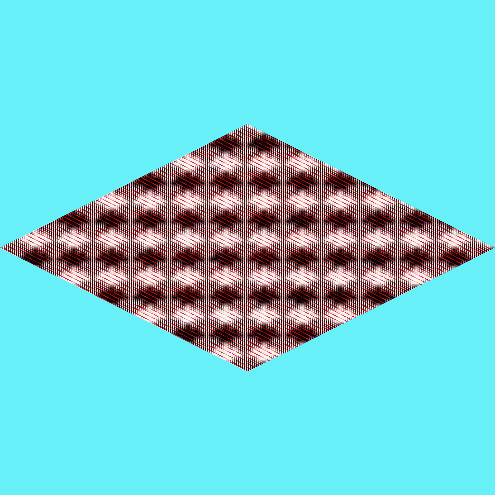

グリッドインデックスからマップ座標を取得するには次のように計算する必要があります。

```go
func GridIndexToMapCoordinate(gridIndex uint16) (int, int) {
    y := gridIndex / gridWidth
    x := gridIndex % gridWidth
    
    y = (y - (gridHeight / 2)) * 8;
    x = (x - (gridWidth / 2)) * 8;
    return x, y
}
```

さらにマップ座標からスクリーン上の座標を得るには次のように計算します。

```go
func MapToScreenPoint(mapX, mapY int) (int, int) {
    halfWidth, halfHeight := mapSize.Width/2, mapSize.Height/2
    x := mapX + mapY + halfWidth
    y := (mapY - mapX)/2 + halfHeight + 2
    return x, y
}
```

スクリーン上の座標を使用して、マップの上に壁の形の画像を描くことができます。

## パラメータ(WallParameter)

```go
type WallParameter struct {
    ZCoordinate int8
    Attributes byte
    ZRange byte
    Shape byte
}
```

セグメントが使用するパラメータは、プレイヤーが壁にぶつかることができる条件と、壁にぶつかったときに何が起きるのかを指定するためのパラメータです。

Walls only apply if the Z coordinate of the object colliding with it is between the wall's Z coordinate and the wall's range (Z coordinate + Z Range).

壁は、衝突する物体のZ座標が`ZCoordinate`と`ZCoordinate+ZRange`の間にある場合にのみ、衝突判定を持ちます。

`Attributes`は壁の種類によって効果が異なります。また壁のタイプによって、利用可能な`Shape`が変わってきます。これらは以下で説明します。

## 境界壁セクション

境界壁として利用可能な`Shape`は次のようになっています。

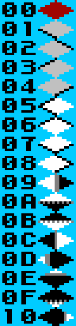

- 赤 = ゲームがクラッシュします
- 黒 = 壁にぶつかります
- 白 = ぶつかりません
- 黒灰 = このピクセルの壁との衝突はプレイヤー座標の小数点以下の部分に依存します。
- 白灰 = タイル全体が衝突としてカウントされることを示すために境界壁の`Shape`でのみ使用されますが、壁がどちら側を向いているかを示すために黒が使用されていました。

境界壁の属性は、0-6bitがID、bit7が壁を無効にする無効化ビットになっています。

- Bits 0-6: ID
- Bit 7: 無効化ビット

無効化ビットが設定されている場合、フラグ`0x1640 + ID`を使用して、この壁の衝突判定を無効にすることができます。

## 標高領域セクション

標高領域には以下の`Shape`があります。

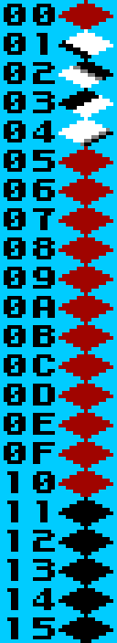

標高領域に衝突するオブジェクトは、そのZ座標が変更されます。

`Shape`が`0x01～0x04`、`0x11` はすべて、オブジェクトのZ座標を `(パラメータ1 + パラメータ3)` に変更します。

`Shape 0x12～0x15` は同じように見えますが、オブジェクトのZ座標に与える影響は若干異なります。

- `0x12`: `Z = (Parameter1 + Parameter3) - (ObjectXDistanceIntoTile >> Parameter2)`
- `0x13`: `Z = (Parameter1 + Parameter3) - (ObjectXDistanceIntoTile - 8 >> Parameter2)`
- `0x14`: `Z = (Parameter1 + Parameter3) - (ObjectYDistanceIntoTile >> Parameter2)`
- `0x15`: `Z = (Parameter1 + Parameter3) - (ObjectYDistanceIntoTile - 8 >> Parameter2)`

上記の計算では、タイルの開始点(0,0)がタイルの左上隅となります。これらの座標は、上記の`GridIndexToMapCoordinate`関数を使用して得られる座標です。

## カバー領域セクション

カバー領域と衝突したオブジェクトはスプライトの優先度が3になります。これにより、上ではなくBG2の下に描画されます。

カバー領域には以下の`Shape`があります。

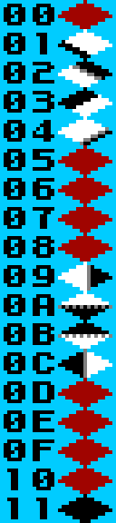

## イベント領域セクション

イベント領域には以下の`Shape`があります。

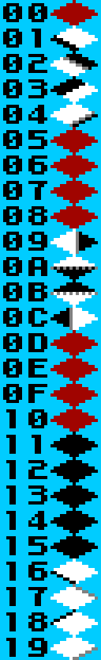

プレイヤーがイベント領域に入った場合、何が起きるかは壁の属性(Attribute)に依存します。

- `0x00`: 衝突は無視される
- `0x01-0x0f`: 現在ロードされているexistsのリストの終了インデックス(`Attribute-1`)を使用する
- `0x10-0x1f`: 通常はフラグリスナーによって使用され、通常はカットシーンのトリガーとして使用される
- `0x20-0x2f`: 通常はフラグリスナーによって使用され、通常はカットシーンのトリガーとして使用される
- `0xf0-0xff`: この属性を持つWallSegmentでAボタンを押すと、現在ロードされているマップオブジェクトのテキストアーカイブからテキストスクリプトインデックス`Attribute - 0xF0`が開始する

**現実世界のみ**

- `0x40-0x58`: このイベント領域にいる間にRボタンを押すと、プラグインのカットシーンが開始され、現在ロードされているプラグインロケーションのリストからプラグインロケーションのインデックス（`Attribute-0x40`）に移動する

**インターネットのみ**

- `0x30`: Rush bridge 1 Front
- `0x31`: Rush bridge 1 Back
- `0x32`: Rush bridge 2 Front
- `0x33`: Rush bridge 2 Back
- `0x34`: Shade effect
- `0x48`: 右上に強制移動開始
- `0x49`: 右下に強制移動開始
- `0x4a`: 左下に強制移動開始
- `0x4b`: 左上に強制移動開始
- `0x4c`: 右上への強制移動終了
- `0x4d`: 右下への強制移動終了
- `0x4e`: 左下への強制移動終了
- `0x4f`: 左上への強制移動終了
- `0x60-0xcf`: 電脳世界(ダンジョン)でマップのギミックに利用
- `0xd0-0xef`: ネットナビ(EX, SP)のエンカウント

## デモマップを用いた説明

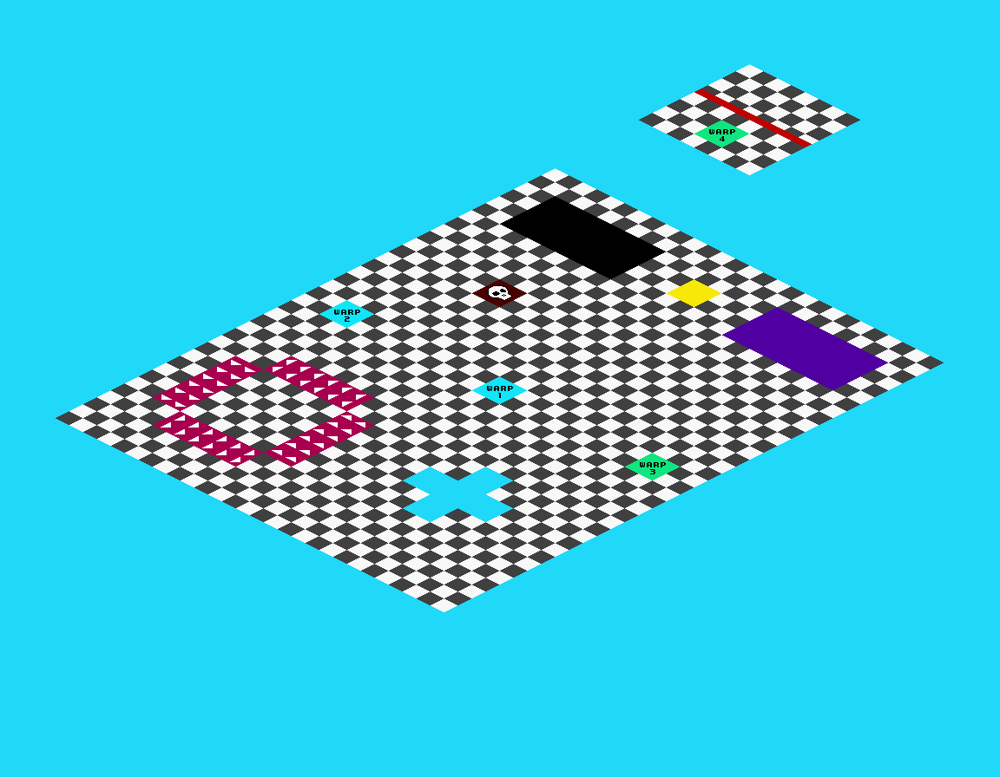

以下は、壁/領域のいくつかと、フラグリスナー（マップスクリプトともいう）、テキストアーカイブ、マップオブジェクトなどの他のマップシステムとの相互作用を示すデモマップを用いた解説です。

簡単にするために、このデモマップはUS版のエグゼ6から削除されたウラインターネット3を置き換えています。

また、壁のグリッドインデックスにラベルを付けるシンプルな市松模様のマップもあります。このマップは`Extra`と呼ばれる使われていないホームページを上書きします。 

このマップには熱斗のPCからプラグインすることができます。

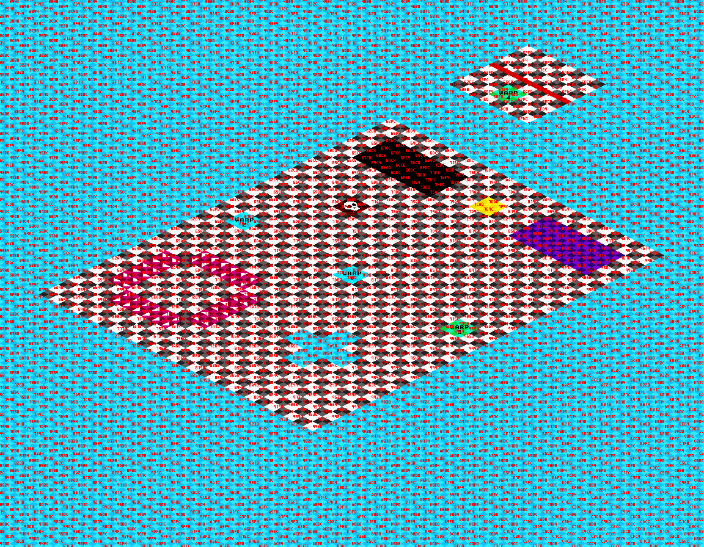

### 境界壁

使用されている境界壁はシンプルなものです。プレイヤーがマップ外にいかないようにマップのグラフィックを囲んでいます。

このデモで使われている他の壁は紫の扉とラッシュの足場です。

### 標高領域

デモマップでは、標高領域は使用していません。

マップ上のすべての壁と領域はZ座標0を使用し、Z範囲は8です。生成された標高領域セクションには`0x00000000`のみが含まれていることに注意してください。プレイヤーのZ座標が8よりも大きい場合、壁と衝突することはありません。

### カバー領域

デモマップでは、黒い領域がカバー領域になっています。プレイヤーがこの領域に入ると、黒い領域がプレイヤーの上に描画されます。

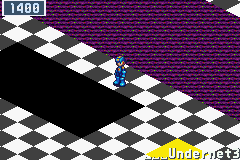

### イベント領域

イベント領域は、デモマップで使う特殊な機能のほとんどを実装するのに使用されています。

**ワープ(exit)**

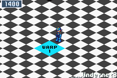 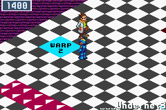 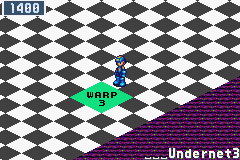

デモマップでは5つのワープ(英語ではExitとも呼ぶ)が存在します。

- Warp1: プラグアウト用のワープ
- Warp2: `Extra`にワープ
- Warp3,4: Warp3 <-> Warp4
- Warp5: グレイガの目の前の赤線

デモマップではプラグアウトとワープのタイルにラベルが貼られており、無効化されたワープ(Warp5)が赤線になっています。

まず、すべてのワープに対してイベント領域を設定します。

ワープは`demo_map/demo_map.asm`で定義されています。

```asm
; demo_map/demo_map.asm

; Exit1
.byte 0x00, 0x00            ; unused
.byte 0x10                  ; プラグアウト
.byte 0x00                  ; unused
.word 0x00000000            ; unused
.word 0x00000000            ; unused
.word 0x00000000            ; unused

; Exit2 Go to checker board map
.byte 0x88, 0x02            ; マップ
.byte 0x08                  ; マップ外ワープ
.byte 0x01                  ; 方向
.word 0x00000000            ; X
.word 0x00000000            ; Y
.word 0x00000000            ; Z

; Exit3
.byte 0x95, 0x03            ; マップ
.byte 0x0C                  ; マップ内ワープ
.byte 0x03                  ; 方向
.word (0x01B0) << 0x10      ; X
.word (0xFF60) << 0x10      ; Y
.word (0x0000) << 0x10      ; Z

; Exit4
.byte 0x95, 0x03            ; マップ
.byte 0x0C                  ; マップ内ワープ
.byte 0x07                  ; 方向
.word (0x0008) << 0x10      ; X
.word (0x00A8) << 0x10      ; Y
.word (0x0000) << 0x10      ; Z
```

このリストでは4つのワープしか定義していないため、プレイヤーが5つ目のワープを使うとゲームがクラッシュします。

そうならないように、初期化時に実行されるマップのフラグリスナーでは、フラグ0x16F5を設定してワープを無効にしています。

そして、`0x02011EA0 + (5*4)`に書き込むことで、単にワープを無視するのではなく、カットシーンが始まることを示しています。

初期化と更新のためのフラグリスナーは`demo_map/demo_map_flag_listener.asm`で定義されています。

```asm
; demo_map/demo_map_flag_listener.asm

; Warp5を無効化 (the one used for backing up cutscene)
FL_SET_FLAG 0x16F5

; Set exit 5 to start a disabled exit cutscene
; ワードを書き込む 各バイトの内容は次の通り
; 08 – 歩く距離
; 05 - 方向
; 00 - メッセージインデックス
; 02 - if = 0 カットシーンは無し, if = 1 カットシーンかNPCのテキストボックスが出現
FL_WRITE_DATA_WORD 0x02011EA0 + (5*4), 0x08050002
```

この設定後、プレイヤーが赤線に入ると、選択されたメッセージインデックスを用いたテキストボックスが表示されます。その後、プレイヤーは、領域内に入ることなく、選択された方向に指定した距離だけ歩きます。

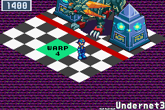

**イベントのトリガー**

フラグリスナー（マップスクリプトともいう）はイベント領域のAttributeに関わらずそこにプレイヤーがいるかどうかをチェックすることができますが、最もよく使われるAttributeは`0x10-0x2F`です。

また、ボスがいる電脳ダンジョンの場合は、マップ特有のギミックとして`0x60-0xCF`が使用されています。

このデモマップでは、タイルを踏むことで発生するイベントが2つあります。

**黄色タイル**

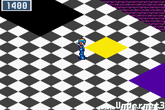

黄色のタイルには`0x10`のAttributeが設定されています。

Updateフラグリスナーは、毎フレーム実行され、このタイルとの衝突をチェックします。

ここでは、`demo_map/demo_map_code.asm`で定義された関数を引数`0x00000000`で呼び出して着色エフェクトをクリアし、プレイヤーが属性`0x10`のタイル上にいる場合は引数`0x00000001`で再度呼び出して着色エフェクトを設定します。

```asm
demo_map_color_shader:
    push r14
    cmp r0,0x00
    bne .enable
    ; r0 is already 0
    bl video_clear_color_effect
    b .endroutine
.enable:
    mov r0,0x0C                 ; color effect
    ldr r1,=0x2108              ; color
    mov r2,0x01                 ; number of palettes
    mov r3,0x00                 ; color effect index
    ldr r4,=palette_bg1_final   ; palette offset
    bl video_set_color_effect
.endroutine:
    mov r0,0x00
    pop r15
```

**グレイガ**

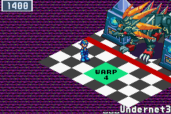

2つ目のイベントは、プレイヤーがマップの小島部分に入った時に発生します。

プレイヤーが小島に入ると、グレイガが唸って画面を揺らし音を鳴らします。

これを行うために、グレイガはNPCとして設定されており、プレイヤーが小島部分に入ったときに立つフラグをチェックするループにジャンプします。

まず、小島のプレイヤーが歩ける部分に、Attributeが`0x11`のイベント領域を設定します。

そして、グレイガにはフラグをチェックするNPCオブジェクトが設定されています。

ループでは、グレイガはフレームごとにフラグ`0x16A0`をチェックします。

このフラグは通常境界壁を無効にするために使用されますが、このマップでは他の目的では使用されないため、ここではこのフラグを使用しています。

フラグがセットされるとNPCスクリプトは、フラグがクリアされるまで、唸り声、音、画面の揺れを行う別のループにジャンプします。

そのために必要なフラグをセットに、Updateフラグリスナーはフラグをクリアし、プレイヤーがAttribute`0x11`のタイル上にいる場合にのみ、再度フラグをセットします。

## References

- [MMBN Map Wall/Region Format](https://forums.therockmanexezone.com/mmbn-map-wall-region-format-t16550.html)
