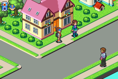
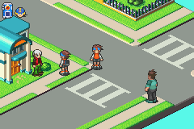

# Map上のNPCの編集

Map上のNPCのリストは

```ts
NPCList_maps00[area][subarea] // GregarJP: 0x80355f4
NPCList_maps80[area][subarea] // GregarJP: 0x803579c
```

に配置されています。

ここにはNPCをロードするプログラムへのポインタのリストがあり、`0x000000ff`を終端としています。

自分で作ったNPCを追加するには、このポインタのリストの`0x000000ff` の前に自分のものを追加しますが、ポインタのオフセットが16を超えると、ゲームはスクリプトを無視するようになっています。

これらのオフセットのいずれかに移動した後のスクリプトコマンドは以下の通りです。

r5 = `0x020057B0 + (index * 0xD8)`

Get map sprite script offsets routine: `spawnOverworldNPCObjsForMap(0x80360e4)`

Breakpoint for script commands: `runPrimaryScriptForNPC(0x80a264c)`

コマンドテーブル: `NPCCommandsJt[cmdIdx]`

`cmdIdx`は`NPC Loading Scripts`のインデックスのことです。

## NPC Loading Scripts

```
00
Terminates script

01
Undefined
(jumps to 00000000)

02 p0 p0 p0 p0
Jump to p0

03
Full Terminator

04 p0 p0 p1 p1 p1 p1
IF flag p0 is checked jump to p1

05 p0 p0 p1 p1 p1 p1
IF flag p0 is not checked jump to p1

06 p0 p0
Sets Flag p0

07 p0 p0
Clear Flag p0

08
Initializes NPC loading? / Makes NPC visable?
(sets type to solid NPC)?

09 
Also a kind of initialization?
Sets to invisable NPC type?

0A p0
Sets NPC bound radius

0B p0
[r5,0xD]=r0

0C p0 p1 p2
Shifts NPC center by X += p0 Y += p1 Z += p2 (signed)

0D
Enables NPC

0E 
Disabled NPC

0F p0
Sets NPC palette to p0

10 p0 
Delay Script execution by p0 frames

11 p0 p1
[r5, 4] = p0
[r5, 5] = p1

12
NPC does turn to face player when spoken to
13
NPC does not turns to face player when spoken to

14 p0 p0 p1 p1 p2 p2
Sets NPC Coordinates to X = po Y = p1 Z = p2 (signed)

15 p0 p1 p2
[r5, 0xE] = p0
[r5, 0x4] = p1
[r5, 0x5] = p2

16 p0
Set NPC animation to animation p0

17 p0
Set NPC Sprite to p0 from sprite list catigory 0x80

18 p0
Sets NPC dialog to entry p0 from first loaded text archive

19
Clears bits at (int)[r5,0x64]

1A 
Sets (int)[r5,0x64] to 2

1B 
Sets (int)[r5,0x64] to 3

1C p0 p0 p0 p0
writes p0 to [r5,0x68]
(last 4 bits hides some oams)

1D p0
Sets bit (31-p0)? in [r5,0x68]

1E p0 
Clears bit (31-p0)? in [r5,0x68]

1F
Makes NPC passable

20
Makes NPC inpassable

21
Clears bit 80 on [r5,0x60] and does something else?

22
Sets bits 0x180 on [r5,0x60]

23
Clears 0x80 clears bit 0x100 and does something else?

24
Clears bit 0x80 and does other things
Sets sprite to current navi sprite

25 p0 p1
Sets NPC Sprite to p0 from spritelist catigory p1

26
Alternates bit 08 on [r5,0x60]
(flips sprite)
27
Sets bit 0x10 on [r5,0x60]
Makes it passable?

28 p0 p0 
???

29 p0 p0
If something set to p0

2A p0
sets [r5, 0x80] to p0 
ends script

2B p0 p0
does stuff
stores p0 in [r5, 0x6]

2C
undefined (jumps to 00000000)

2D p0 p1
?

2E p0
?

2F p0 p1 p2
?

30
?

31 p0

32 p0 p0 p0 p0
jumps to p0
(for other script type)


33 p0 
stores p0 in [r5,0x22]
Terminates other script
Waits p0 frames before resuming

34
[r0,0x22] = 0
[r5,0x5C] = 0
jumps script to 0 

35 p0 p0 p0 p0 
Terminates, writes p0 to [r5,0x7C] with link ([r5,0x8C])
( Ends script and executes routine at p0)

36 p0 p0 p0 p0
Jump to p0 with link ([r5,0x8C])

37 p0 p1 p2 p3 p4 p4 p4 p4
Writes currentoffset + 9 to [r5,0x8C]
[r5,0x0E] = p0
[r5,0x04] = p1
[r5,0x05] = p2
[r5,0x20] = p3
, writes p4 to ([r5,0x7C])(executes routine).

38 p0 p1 p2 p3 p3 p3 p3
NPC moves in a path
p0 - movement type
p1 - speed
p2 - distance
p3 - offsets of sequence script

39 p0
Changes movement type
3A 
Returns to linked routine  [r5,0x8C]

3B p0 p1 p2 p2 p2 p2
If story progress byte [0x02001b86] is
greater than p0 and less than p1 jump script to p2

3C p0 p1
[0x02011C50 + r0] = r1

3D p0 p1 p2 p2 p2 p2
IF [0x02011C50 + r0] == r1
Jump to p2
3F p0 p1
stores p0 in [r5,0x80]
stores p1 in [r5,0x84]
Ends script

40
Clears bit 0x200 from [r5,0x60]

41
Sets bit 0x200 from [r5,0x60]

42
Undefined, jumps to 0x00000000

43
Undefined, jumps to 0x00000000

44 p0 p1 p1 p1 p1
(Sets NPC dialog to entry r0 from 2nd loaded text archive)
Sets dialog p0 and sets bit 0x400 on [r5,0x60]
Writes p1 to [r5,0x94]

45 p0 p0
Stores p0 at 0x02005C68 and terminates script? (r5 + 0x80)
(Checked later and does stuff if it's set)

46 p0
Clears 0xC bits somewhere ([r5 + (([r5,2] >> 4)<<4) + 0x11]) , if p0 ==0 sets bit 8

47 p0 p0
???

48 
Sets 0x20 bit somewhere ([r5 + (([r5,2] >> 4)<<4) + 0x3])
49 
Clears 0x1 bit  and 0x4 bit somewhere ([r5 + (([r5,2] >> 4)<<4) + 0x3])
4A p0 p1 p1
writes p0 to [0200998E]
writes p1 to [0200998C]

4B p0 p1 p1 p1 p1
if p0 != [r5,0x14]
jump to p1

4C p0
Sets NPC's dialog to entry p0 from 2nd loaded text archive.

4D p0 p0 p0 p0 p1 p1 p1 p1
Jumps to p1?

4E p0 p1 p2 p3
writes p0-p3 to [r5,4-7]
ends script

4F p0 p1 p2
writes p0-p2 to [r5,4-6]
ends script

50 p0 p1 p2 p3
writes r0-p3 to [r5,4-7]

51 p0 p0 
?
52
does stuff ( causes a jack out animation )
53 p0 p0 p0 p0
Jumps to p0 if [0x0200A443] != 0
```

説明が不十分な箇所もありますが、あまり使われていないようなので今のところはわからないままでも問題ないです。

## 改造例

### 例1:



棒立ちでプレイヤーと会話できるNPCを作る場合

```asm
    .byte 0x08                        ; Initialize?
    .byte 0x17,0x13                   ; Set to sprite 0x13 (Teacher character)
    .byte 0x4C,0x15                   ; Set Dialog 03
    .byte 0x14                        ; Set Coordinates
    .hword 0x0010                     ; X=0xA0
    .hword 0x0048                     ; Y=0x48
    .hword 0x0000                     ; Z=00
    .byte 0x16, 0x03                  ; Set to animation 03
    .byte 0x36,0xCC,0xF6,0x09,0x08    ; jumps to a generic handler? ( seems to be required)
```

### 例2:



歩き回ることができプレイヤーと会話できるNPCを作る場合

この例では、私が持っているFalzerUSのROMの空き領域である`0x087FE380`にデータを書き込んでいます。

```asm
NPCScriptLocation:
    .byte 0x08                      ; Initialize?
    .byte 0x17,0x00                 ; Set to sprite 00 (Lan)
    .byte 0x4C,0x03                 ; Set Dialog 03
    .byte 0x14                      ; Set Coordinates
    .hword 0x00A0                   ; X=0xA0
    .hword 0x0048                   ; Y=0x48
    .hword 0x0000                   ; Z=00
    .byte 0x16, 0x03                ; Set to animation 03
    .byte 0x38, 0x05, 0x06, 0x0B    ; Set to moving NPC?
    .word MovementHandler           ; Jump to movement handler
MovementHandler:
    .byte 0x16, 0x07                ; Idle for a bit
    .byte 0x10, 0x40                ; wait 0x40 frames
    .byte 0x16, 0x05                ; turns both ways before crossing the street
    .byte 0x10, 0x20                ; wait 0x20 frames
    .byte 0x16, 0x01                ; turns both ways before crossing the street
    .byte 0x10, 0x20                ; wait 0x20 frames
    .byte 0x16, 0x0B                ; Moving down right animation
    .byte 0x39, 0x06                ; start moving downright
    .byte 0x16, 0x03                ; Idle for a bit
    .byte 0x10, 0x40                ; wait 0x40 frames
    .byte 0x16, 0x05                ; turns both ways before crossing the street
    .byte 0x10, 0x20                ; wait 0x20 frames
    .byte 0x16, 0x01                ; turns both ways before crossing the street
    .byte 0x10, 0x20                ; wait 0x20 frames
    .byte 0x16, 0x0F                ; Moving down right animation
    .byte 0x39, 0x02                ; start moving downright
    .byte 0x02                      ; Unconditional Jump(required for loop)
    .word MovementHandler           ; jump back to start of path
```

## 参考記事

- [Modifying Map NPCs](https://forums.therockmanexezone.com/modifying-map-npcs-t5333.html)
